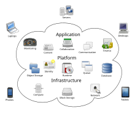
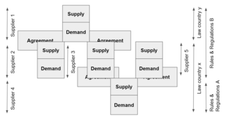
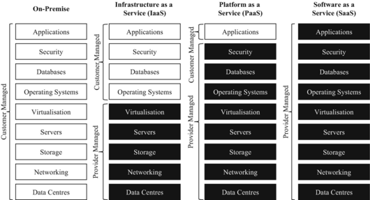
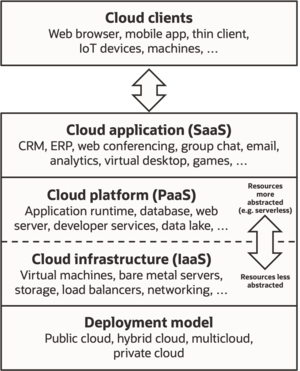
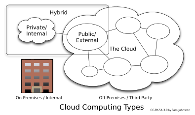
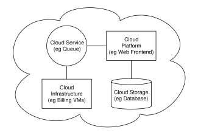

Form of shared internet-based computing

Cloud computing metaphor: the group of networked elements providing services does not need to be addressed or managed individually by users; instead, the entire provider-managed suite of hardware and software can be thought of as an amorphous cloud.

**Cloud computing**[1] is the on-demand availability of [computer](/wiki/Computer "Computer") [system resources](/wiki/System_resource "System resource"), especially data storage ([cloud storage](/wiki/Cloud_storage "Cloud storage")) and [computing power](/wiki/Computing_power "Computing power"), without direct active management by the user.[2] Large clouds often have functions [distributed](/wiki/Distributed_computing "Distributed computing") over multiple locations, each of which is a [data center](/wiki/Data_center "Data center"). Cloud computing relies on sharing of resources to achieve coherence and typically uses a pay-as-you-go model, which can help in reducing [capital expenses](/wiki/Capital_expenses "Capital expenses") but may also lead to unexpected [operating expenses](/wiki/Operating_expense "Operating expense") for users.[3][4]

## Definition

A [European Commission](/wiki/European_Commission "European Commission") communication issued in 2012 argued that the breadth of scope offered by cloud computing made a general definition "elusive",[5] whereas the [United States National Institute of Standards and Technology](/wiki/National_Institute_of_Standards_and_Technology "National Institute of Standards and Technology")'s 2011 definition of cloud computing identified "five essential characteristics": 

  * **On-demand self-service.** A consumer can unilaterally provision computing capabilities, such as server time and network storage, as needed automatically without requiring human interaction with each service provider.
  * **Broad network access.** Capabilities are available over the network and accessed through standard mechanisms that promote use by heterogeneous thin or thick client platforms (e.g., mobile phones, tablets, [laptops](/wiki/Laptop "Laptop"), and workstations).
  * **[Resource pooling](/wiki/Pooling_\(resource_management\) "Pooling \(resource management\)").** The provider's computing resources are pooled to serve multiple consumers using a multi-tenant model, with different physical and virtual resources dynamically assigned and reassigned according to consumer demand. 
  * **Rapid elasticity.** Capabilities can be elastically provisioned and released, in some cases automatically, to scale rapidly outward and inward commensurate with demand. To the consumer, the capabilities available for provisioning often appear unlimited and can be appropriated in any quantity at any time.
  * **Measured service.** Cloud systems automatically control and optimize resource use by leveraging a metering capability at some level of abstraction appropriate to the type of service (e.g., storage, processing, bandwidth, and active user accounts). Resource usage can be monitored, controlled, and reported, providing transparency for both the provider and consumer of the utilized service,[6] although for some organisations the revenue impact of high usage may affect profitability, compared to an option of sunk capital costs.[4]

## History

Cloud computing has a rich history which extends back to the 1960s, with the initial concepts of time-sharing becoming popularized via [remote job entry](/wiki/Remote_job_entry "Remote job entry") (RJE). The "data center" model, where users submitted jobs to operators to run on mainframes, was predominantly used during this era. This was a time of exploration and experimentation with ways to make large-scale computing power available to more users through [time-sharing](/wiki/Time-sharing "Time-sharing"), optimizing the infrastructure, platform, and applications, and increasing efficiency for end users.[7]

The "cloud" metaphor for virtualized services dates to 1994, when it was used by [General Magic](/wiki/General_Magic "General Magic") for the universe of "places" that mobile agents in the [Telescript](/wiki/Telescript_\(programming_language\) "Telescript \(programming language\)") environment could "go". The metaphor is credited to David Hoffman, a General Magic communications specialist, based on its long-standing use in networking and telecom.[8] The expression _cloud computing_ became more widely known in 1996 when [Compaq Computer Corporation](/wiki/Compaq_Computer_Corporation "Compaq Computer Corporation") drew up a [business plan](/wiki/Business_plan "Business plan") for future computing and the [Internet](/wiki/Internet "Internet"). The company's ambition was to supercharge [sales](/wiki/Sales "Sales") with "cloud computing-enabled applications". The business plan foresaw that online consumer file storage would likely be commercially successful. As a result, Compaq decided to sell [server](/wiki/Server_\(computing\) "Server \(computing\)") hardware to [internet service providers](/wiki/Internet_service_provider "Internet service provider").[9]

In the 2000s, the application of cloud computing began to take shape with the establishment of [Amazon Web Services](/wiki/Amazon_Web_Services "Amazon Web Services") (AWS) in 2002, which allowed developers to build applications independently. In 2006 the beta version of [Google Docs](/wiki/Google_Docs "Google Docs") was released, Amazon Simple Storage Service, known as [Amazon S3](/wiki/Amazon_S3 "Amazon S3"), and the [Amazon Elastic Compute Cloud](/wiki/Amazon_Elastic_Compute_Cloud "Amazon Elastic Compute Cloud") (EC2), in 2008 [NASA](/wiki/NASA "NASA")'s development of the first [open-source software](/wiki/Open-source_software "Open-source software") for deploying private and hybrid clouds.[10][11]

The following decade saw the launch of various cloud services. In 2010, [Microsoft](/wiki/Microsoft "Microsoft") launched [Microsoft Azure](/wiki/Microsoft_Azure "Microsoft Azure"), and [Rackspace Hosting](/wiki/Rackspace_Technology "Rackspace Technology") and [NASA](/wiki/NASA "NASA") initiated an open-source cloud-software project, [OpenStack](/wiki/OpenStack "OpenStack"). [IBM](/wiki/IBM "IBM") introduced the [IBM SmartCloud](/wiki/IBM_Cloud "IBM Cloud") framework in 2011, and [Oracle](/wiki/Oracle_Corporation "Oracle Corporation") announced the [Oracle Cloud](/wiki/Oracle_Cloud "Oracle Cloud") in 2012. In December 2019, Amazon launched AWS Outposts, a service that extends AWS infrastructure, services, [APIs](/wiki/API "API"), and tools to customer data centers, co-location spaces, or on-premises facilities.[12][13]

Since the [global pandemic](/wiki/COVID-19_pandemic "COVID-19 pandemic") of 2020, cloud technology has surged in popularity due to the level of data security it offers and the flexibility of working options it provides for all employees, notably remote workers.[14]

## Value proposition

Advocates of public and hybrid clouds claim that cloud computing allows companies to avoid or minimize up-front [IT infrastructure](/wiki/IT_infrastructure "IT infrastructure") costs. Proponents also claim that cloud computing allows [enterprises](/wiki/Company "Company") to get their [applications](/wiki/Application_software "Application software") up and running faster, with improved manageability and less maintenance, and that it enables IT teams to more rapidly adjust resources to meet fluctuating and unpredictable demand,[15][16][17] providing **burst computing** capability: high computing power at certain periods of peak demand.[18]

Additional value propositions of cloud computing include: 

Topic  | Description   
---|---  
Cost reductions  | A public-cloud delivery model converts [capital expenditures](/wiki/Capital_expenditure "Capital expenditure") (e.g., buying servers) to [operational expenditure](/wiki/Operational_expenditure "Operational expenditure").[19] This purportedly lowers [barriers to entry](/wiki/Barriers_to_entry "Barriers to entry"), as infrastructure is typically provided by a third party and need not be purchased for one-time or infrequent intensive computing tasks. Pricing on a utility computing basis is "fine-grained", with usage-based billing options. As well, less in-house IT skills are required for implementation of projects that use cloud computing.[20] The e-FISCAL project's state-of-the-art repository[21] contains several articles looking into cost aspects in more detail, most of them concluding that costs savings depend on the type of activities supported and the type of infrastructure available in-house.   
Device independence  | Device and location independence[22] enable users to access systems using a web browser regardless of their location or what device they use (e.g., PC, mobile phone). As infrastructure is off-site (typically provided by a third-party) and accessed via the Internet, users can connect to it from anywhere.[20][a]  
Maintenance  | Maintenance of cloud environment is easier because the data is hosted on an outside server maintained by a provider without the need to invest in data center hardware. IT maintenance of cloud computing is managed and updated by the cloud provider's IT maintenance team which reduces cloud computing costs compared with on-premises data centers.   
Multitenancy  | Multitenancy enables sharing of resources and costs across a large pool of users thus allowing for: 

  * centralization of infrastructure in locations with lower costs (such as real estate, electricity, etc.)
  * peak-load capacity increases (users need not engineer and pay for the resources and equipment to meet their highest possible load-levels)
  * utilization and efficiency improvements for systems that are often only 10–20% utilized.[23][24]

  
Performance  | Performance is monitored by IT experts from the service provider, and consistent and loosely coupled architectures are constructed using [web services](/wiki/Web_services "Web services") as the system interface.[20][25]  
Productivity  | Productivity may be increased when multiple users can work on the same data simultaneously, rather than waiting for it to be saved and emailed. Time may be saved as information does not need to be re-entered when fields are matched, nor do users need to install application software upgrades to their computer.   
Availability  | Availability improves with the use of multiple redundant sites, which makes well-designed cloud computing suitable for [business continuity](/wiki/Business_continuity "Business continuity") and [disaster recovery](/wiki/Disaster_recovery "Disaster recovery").[26]  
Scalability and elasticity  | Scalability and elasticity via dynamic ("on-demand") provisioning of resources on a fine-grained, self-service basis in near real-time,[27][28][b] without users having to engineer for peak loads.[29][30][31] This gives the ability to scale up when the usage need increases or down if resources are not being used.[32] The time-efficient benefit of cloud scalability also means faster time to market, more business flexibility, and adaptability, as adding new resources does not take as much time as it used to.[33] Emerging approaches for managing elasticity include the use of machine learning techniques to propose efficient elasticity models.[34]  
[Security](/wiki/Computer_security "Computer security") | Security can improve due to centralization of data, increased security-focused resources, etc., but concerns can persist about loss of control over certain sensitive data, and the lack of security for stored [kernels](/wiki/Kernel_\(operating_system\) "Kernel \(operating system\)"). Security is often as good as or better than other traditional systems, in part because service providers are able to devote resources to solving security issues that many customers cannot afford to tackle or which they lack the technical skills to address.[35] However, the complexity of security is greatly increased when data is distributed over a wider area or over a greater number of devices, as well as in multi-tenant systems shared by unrelated users. In addition, user access to security [audit logs](/wiki/Audit_log "Audit log") may be difficult or impossible. Private cloud installations are in part motivated by users' desire to retain control over the infrastructure and avoid losing control of information security.   
  
## Challenges and limitations

One of the main challenges of cloud computing, in comparison to more traditional on-premises computing, is data security and privacy. Cloud users entrust their sensitive data to third-party providers, who may not have adequate measures to protect it from unauthorized access, breaches, or leaks. Cloud users also face compliance risks if they have to adhere to certain regulations or standards regarding data protection, such as [GDPR](/wiki/GDPR "GDPR") or [HIPAA](/wiki/HIPAA "HIPAA").[36]

Another challenge of cloud computing is reduced visibility and control. Cloud users may not have full insight into how their cloud resources are managed, configured, or optimized by their providers. They may also have limited ability to customize or modify their cloud services according to their specific needs or preferences.[36] Complete understanding of all technology may be impossible, especially given the scale, complexity, and deliberate opacity of contemporary systems; however, there is a need for understanding complex technologies and their interconnections to have power and agency within them.[37] The [metaphor](/wiki/Metaphor "Metaphor") of the cloud can be seen as problematic as cloud computing retains the aura of something [noumenal](/wiki/Noumenon "Noumenon") and [numinous](/wiki/Numinous "Numinous"); it is something experienced without precisely understanding what it is or how it works.[38]

Additionally, cloud migration is a significant challenge. This process involves transferring data, applications, or workloads from one cloud environment to another, or from on-premises infrastructure to the cloud. Cloud migration can be complicated, time-consuming, and expensive, particularly when there are compatibility issues between different cloud platforms or architectures. If not carefully planned and executed, cloud migration can lead to downtime, reduced performance, or even data loss.[39]

### Security and privacy

Cloud suppliers security and privacy agreements must be aligned to the demand(s) requirements and requlations.

Cloud computing poses privacy concerns because the service provider can access the data that is in the cloud at any time. It could accidentally or deliberately alter or delete information.[40] Many cloud providers can share information with third parties if necessary for purposes of law and order without a warrant. That is permitted in their privacy policies, which users must agree to before they start using cloud services. Solutions to privacy include policy and legislation as well as end-users' choices for how data is stored.[40] Users can encrypt data that is processed or stored within the cloud to prevent unauthorized access.[40] [Identity management systems](/wiki/Identity_management_systems "Identity management systems") can also provide practical solutions to privacy concerns in cloud computing. These systems distinguish between authorized and unauthorized users and determine the amount of data that is accessible to each entity.[41] The systems work by creating and describing identities, recording activities, and getting rid of unused identities. 

According to the Cloud Security Alliance, the top three threats in the cloud are _Insecure Interfaces and APIs_ , _Data Loss & Leakage_, and _Hardware Failure_ —which accounted for 29%, 25% and 10% of all cloud security outages respectively. Together, these form shared technology vulnerabilities. In a cloud provider platform being shared by different users, there may be a possibility that information belonging to different customers resides on the same data server. Additionally, [Eugene Schultz](/wiki/Eugene_Schultz "Eugene Schultz"), chief technology officer at Emagined Security, said that hackers are spending substantial time and effort looking for ways to penetrate the cloud. "There are some real Achilles' heels in the cloud infrastructure that are making big holes for the bad guys to get into". Because data from hundreds or thousands of companies can be stored on large cloud servers, hackers can theoretically gain control of huge stores of information through a single attack—a process he called "hyperjacking". Some examples of this include the Dropbox security breach, and iCloud 2014 leak.[42] Dropbox had been breached in October 2014, having over seven million of its users passwords stolen by hackers in an effort to get monetary value from it by Bitcoins (BTC). By having these passwords, they are able to read [private data](/wiki/Information_privacy "Information privacy") as well as have this data be indexed by search engines (making the information public).[42]

There is the problem of legal ownership of the data (If a user stores some data in the cloud, can the cloud provider profit from it?). Many Terms of Service agreements are silent on the question of ownership.[43] Physical control of the computer equipment (private cloud) is more secure than having the equipment off-site and under someone else's control (public cloud). This delivers great incentive to public cloud computing service providers to prioritize building and maintaining strong management of secure services.[44] Some small businesses that do not have expertise in [IT](/wiki/Information_technology "Information technology") security could find that it is more secure for them to use a public cloud. There is the risk that end users do not understand the issues involved when signing on to a cloud service (persons sometimes do not read the many pages of the terms of service agreement, and just click "Accept" without reading). This is important now that cloud computing is common and required for some services to work, for example for an [intelligent personal assistant](/wiki/Intelligent_personal_assistant "Intelligent personal assistant") (Apple's [Siri](/wiki/Siri "Siri") or [Google Assistant](/wiki/Google_Assistant "Google Assistant")). Fundamentally, private cloud is seen as more secure with higher levels of control for the owner, however public cloud is seen to be more flexible and requires less time and money investment from the user.[45]

The attacks that can be made on cloud computing systems include [man-in-the middle](/wiki/Man-in-the-middle_attack "Man-in-the-middle attack") attacks, [phishing](/wiki/Phishing "Phishing") attacks, authentication attacks, and [malware](/wiki/Malware "Malware") attacks. One of the largest threats is considered to be malware attacks, such as [Trojan horses](/wiki/Trojan_horse_\(computing\) "Trojan horse \(computing\)"). Recent research conducted in 2022 has revealed that the Trojan horse injection method is a serious problem with harmful impacts on cloud computing systems.[46]

## Service models

Comparison of on-premise, IaaS, PaaS, and SaaS .png)Cloud computing service models arranged as layers in a stack

The [service-oriented architecture](/wiki/Service-oriented_architecture "Service-oriented architecture") (SOA) promotes the idea of "Everything as a Service" (EaaS or XaaS, or simply aAsS).[47] This concept is operationalized in cloud computing through several service models as defined by the [National Institute of Standards and Technology](/wiki/National_Institute_of_Standards_and_Technology "National Institute of Standards and Technology") (NIST). The three standard service models are [Infrastructure as a Service](/wiki/Infrastructure_as_a_service "Infrastructure as a service") (IaaS), [Platform as a Service](/wiki/Platform_as_a_service "Platform as a service") (PaaS), and [Software as a Service](/wiki/Software_as_a_service "Software as a service") (SaaS).[6] They are commonly depicted as layers in a stack, providing different levels of [abstraction](/wiki/Abstraction_\(computer_science\) "Abstraction \(computer science\)"). However, these layers are not necessarily interdependent. For instance, SaaS can be delivered on [bare metal](/wiki/Bare_metal "Bare metal"), bypassing PaaS and IaaS, and a program can run directly on IaaS without being packaged as SaaS. 

### Infrastructure as a service (IaaS)

Infrastructure as a service (IaaS) refers to online services that provide high-level [APIs](/wiki/API "API") used to [abstract](/wiki/Abstraction_\(computer_science\) "Abstraction \(computer science\)") various low-level details of underlying network infrastructure like physical computing resources, location, data partitioning, scaling, security, backup, etc. A [hypervisor](/wiki/Hypervisor "Hypervisor") runs the virtual machines as guests. Pools of hypervisors within the cloud operational system can support large numbers of [virtual machines](/wiki/Virtual_machine "Virtual machine") and the ability to scale services up and down according to customers' varying requirements. Linux [containers](/wiki/Container_\(virtualization\) "Container \(virtualization\)") run in isolated partitions of a single [Linux kernel](/wiki/Linux_kernel "Linux kernel") running directly on the physical hardware. Linux [cgroups](/wiki/Cgroups "Cgroups") and [namespaces](/wiki/Namespace "Namespace") are the underlying Linux kernel technologies used to isolate, secure and manage the containers. The use of containers offers higher performance than virtualization because there is no hypervisor overhead. IaaS clouds often offer additional resources such as a virtual-machine [disk-image](/wiki/Disk_image "Disk image") library, raw [block storage](/wiki/Block_storage "Block storage"), file or [object storage](/wiki/Object_storage "Object storage"), firewalls, [load balancers](/wiki/Load_balancing_\(computing\) "Load balancing \(computing\)"), [IP addresses](/wiki/IP_address "IP address"), [virtual local area networks](/wiki/VLAN "VLAN") (VLANs), and software bundles.[48]

The [NIST](/wiki/NIST "NIST")'s definition of cloud computing describes IaaS as "where the consumer is able to deploy and run arbitrary software, which can include operating systems and applications. The consumer does not manage or control the underlying cloud infrastructure but has control over operating systems, storage, and deployed applications; and possibly limited control of select networking components (e.g., host firewalls)."[6]

IaaS-cloud providers supply these resources on-demand from their large pools of equipment installed in [data centers](/wiki/Data_centers "Data centers"). For [wide-area](/wiki/Wide_area_network "Wide area network") connectivity, customers can use either the Internet or [carrier clouds](/wiki/Carrier_cloud "Carrier cloud") (dedicated [virtual private networks](/wiki/Virtual_private_network "Virtual private network")). To deploy their applications, cloud users install operating-system images and their application software on the cloud infrastructure. In this model, the cloud user patches and maintains the operating systems and the application software. Cloud providers typically bill IaaS services on a utility computing basis: cost reflects the number of resources allocated and consumed.[49]

### Platform as a service (PaaS)

The [NIST](/wiki/NIST "NIST")'s definition of cloud computing defines Platform as a Service as:[6]

> The capability provided to the consumer is to deploy onto the cloud infrastructure consumer-created or acquired applications created using programming languages, libraries, services, and tools supported by the provider. The consumer does not manage or control the underlying cloud infrastructure including network, servers, operating systems, or storage, but has control over the deployed applications and possibly configuration settings for the application-hosting environment.

PaaS vendors offer a development environment to application developers. The provider typically develops toolkit and standards for development and channels for distribution and payment. In the PaaS models, cloud providers deliver a [computing platform](/wiki/Computing_platform "Computing platform"), typically including an operating system, programming-language execution environment, database, and the web server. Application developers develop and run their software on a cloud platform instead of directly buying and managing the underlying hardware and software layers. With some PaaS, the underlying computer and storage resources scale automatically to match application demand so that the cloud user does not have to allocate resources manually.[50][_[need quotation to verify](/wiki/Wikipedia:Verifiability "Wikipedia:Verifiability")_]

Some integration and data management providers also use specialized applications of PaaS as delivery models for data. Examples include **iPaaS (Integration Platform as a Service)** and **dPaaS (Data Platform as a Service)**. iPaaS enables customers to develop, execute and govern integration flows.[51] Under the iPaaS integration model, customers drive the development and deployment of integrations without installing or managing any hardware or middleware.[52] dPaaS delivers integration—and data-management—products as a fully managed service.[53] Under the dPaaS model, the PaaS provider, not the customer, manages the development and execution of programs by building data applications for the customer. dPaaS users access data through [data-visualization](/wiki/Data_visualization "Data visualization") tools.[54]

### Software as a service (SaaS)

The [NIST](/wiki/NIST "NIST")'s definition of cloud computing defines Software as a Service as:[6]

> The capability provided to the consumer is to use the provider's applications running on a [cloud infrastructure](/wiki/Cloud_infrastructure "Cloud infrastructure"). The applications are accessible from various client devices through either a thin client interface, such as a web browser (e.g., web-based email), or a program interface. The consumer does not manage or control the underlying cloud infrastructure including network, servers, operating systems, storage, or even individual application capabilities, with the possible exception of limited user-specific application configuration settings.

In the software as a service (SaaS) model, users gain access to application software and [databases](/wiki/Databases "Databases"). Cloud providers manage the infrastructure and platforms that run the applications. SaaS is sometimes referred to as "on-demand software" and is usually priced on a pay-per-use basis or using a subscription fee.[55] In the SaaS model, cloud providers install and operate application software in the cloud and cloud users access the software from cloud clients. Cloud users do not manage the cloud infrastructure and platform where the application runs. This eliminates the need to install and run the application on the cloud user's own computers, which simplifies maintenance and support. Cloud applications differ from other applications in their scalability—which can be achieved by cloning tasks onto multiple virtual machines at run-time to meet changing work demand.[56] [Load balancers](/wiki/Load_balancer "Load balancer") distribute the work over the set of virtual machines. This process is transparent to the cloud user, who sees only a single access-point. To accommodate a large number of cloud users, cloud applications can be _[multitenant](/wiki/Multitenant "Multitenant")_ , meaning that any machine may serve more than one cloud-user organization. 

The pricing model for SaaS applications is typically a monthly or yearly flat fee per user,[57] so prices become scalable and adjustable if users are added or removed at any point. It may also be free.[58] Proponents claim that SaaS gives a [business](/wiki/Business "Business") the potential to reduce IT operational costs by [outsourcing](/wiki/Outsourcing "Outsourcing") hardware and software maintenance and support to the cloud provider. This enables the business to reallocate IT operations costs away from hardware/software spending and from personnel expenses, towards meeting other goals. In addition, with applications hosted centrally, updates can be released without the need for users to install new software. One drawback of [SaaS](/wiki/Software_as_a_service "Software as a service") comes with storing the users' data on the cloud provider's server. As a result,[_[citation needed](/wiki/Wikipedia:Citation_needed "Wikipedia:Citation needed")_] there could be unauthorized access to the data.[59] Examples of applications offered as SaaS are [games](/wiki/Cloud_gaming "Cloud gaming") and productivity software like Google Docs and Office Online. SaaS applications may be integrated with [cloud storage](/wiki/Cloud_storage "Cloud storage") or [File hosting services](/wiki/File_hosting_service "File hosting service"), which is the case with [Google Docs](/wiki/Google_Docs "Google Docs") being integrated with [Google Drive](/wiki/Google_Drive "Google Drive"), and [Office Online](/wiki/Office_Online "Office Online") being integrated with [OneDrive](/wiki/OneDrive "OneDrive").[60]

### "Backend" as a service (BaaS)

In the "backend" as a service (m) model, also known as "mobile backend as a service" (MBaaS), [web app](/wiki/Web_app "Web app") and [mobile app](/wiki/Mobile_app "Mobile app") developers are provided with a way to link their applications to [cloud storage](/wiki/Cloud_storage "Cloud storage") and cloud computing services with [application programming interfaces](/wiki/Application_programming_interface "Application programming interface") (APIs) exposed to their applications and custom [software development kits](/wiki/Software_development_kit "Software development kit") (SDKs). Services include [user](/wiki/User_\(computing\) "User \(computing\)") management, [push notifications](/wiki/Push_technology "Push technology"), integration with [social networking services](/wiki/Social_networking_service "Social networking service")[61] and more. This is a relatively recent model in cloud computing,[62] with most BaaS [startups](/wiki/Startup_company "Startup company") dating from 2011 or later[63][64][65] but trends indicate that these services are gaining significant mainstream traction with enterprise consumers.[66]

### Serverless computing or Function-as-a-Service (FaaS)

Serverless computing is a cloud computing code [execution](/wiki/Execution_\(computing\) "Execution \(computing\)") model in which the cloud provider fully manages starting and stopping [virtual machines](/wiki/Virtual_machines "Virtual machines") as necessary to serve requests. Requests are billed by an abstract measure of the resources required to satisfy the request, rather than per virtual machine per hour.[67] Despite the name, serverless computing does not actually involve running code without servers.[67] The business or person using the system does not have to purchase, rent or provide servers or virtual machines for the [back-end](/wiki/Back-end_database "Back-end database") code to run on. 

Function as a Service (FaaS) is a remote procedure call hosted as a service, leveraging serverless computing to deploy individual functions in the cloud that run in response to specific events.[68] Some consider FaaS to fall under the umbrella of [serverless computing](/wiki/Serverless_computing "Serverless computing"), while others use the terms interchangeably.[69]

## Deployment models

Cloud computing types

The deployment of services to the cloud is referred to as cloud migration. 

Reverse cloud migration, also known as cloud repatriation, refers to moving cloud-based workloads back to on-premises infrastructures including enterprise data centers, colocation providers, and managed service providers. Cloud repatriation occurs due to security concerns, costs, performance issues, compatibility problems, and uptime concerns.[70][71]

### Private

Private cloud is cloud infrastructure operated solely for a single organization, whether managed internally or by a third party, and hosted either internally or externally.[6] Undertaking a private cloud project requires significant engagement to virtualize the business environment, and requires the organization to reevaluate decisions about existing resources. It can improve business, but every step in the project raises security issues that must be addressed to prevent serious vulnerabilities. Self-run [data centers](/wiki/Data_center "Data center")[72] are generally capital intensive. They have a significant physical footprint, requiring allocations of space, hardware, and environmental controls. These assets have to be refreshed periodically, resulting in additional capital expenditures. They have attracted criticism because users "still have to buy, build, and manage them" and thus do not benefit from less hands-on management,[73] essentially "[lacking] the economic model that makes cloud computing such an intriguing concept".[74][75]

### Public

Cloud services are considered "public" when they are delivered over the public Internet, and they may be offered as a paid subscription, or free of charge.[76] Architecturally, there are few differences between public- and private-cloud services, but security concerns increase substantially when services (applications, storage, and other resources) are shared by multiple customers. Most public-cloud providers offer direct-connection services that allow customers to securely link their legacy data centers to their cloud-resident applications.[20][77]

Several factors like the functionality of the solutions, [cost](/wiki/Costing "Costing"), integrational and [organizational](/wiki/Organization "Organization") aspects as well as [safety & security](/wiki/Security "Security") are influencing the decision of enterprises and organizations to choose a public cloud or [on-premises](/wiki/On-premises_software "On-premises software") solution.[78]

### Hybrid

**Hybrid** cloud is a composition of a public cloud and a private environment, such as a private cloud or on-premises resources,[79][80] that remain distinct entities but are bound together, offering the benefits of multiple deployment models. Hybrid cloud can also mean the ability to connect collocation, managed and/or dedicated services with cloud resources.[6] [Gartner](/wiki/Gartner "Gartner") defines a hybrid cloud service as a cloud computing service that is composed of some combination of private, public and community cloud services, from different service providers.[81] A hybrid cloud service crosses isolation and provider boundaries so that it cannot be simply put in one category of private, public, or community cloud service. It allows one to extend either the capacity or the capability of a cloud service, by aggregation, integration or customization with another cloud service. 

Varied use cases for hybrid cloud composition exist. For example, an organization may store sensitive client data in house on a private cloud application, but interconnect that application to a business intelligence application provided on a public cloud as a software service.[82] This example of hybrid cloud extends the capabilities of the enterprise to deliver a specific business service through the addition of externally available public cloud services. Hybrid cloud adoption depends on a number of factors such as data security and compliance requirements, level of control needed over data, and the applications an organization uses.[83]

Another example of hybrid cloud is one where [IT](/wiki/Information_technology "Information technology") organizations use public cloud computing resources to meet temporary capacity needs that can not be met by the private cloud.[84] This capability enables hybrid clouds to employ cloud bursting for scaling across clouds.[6] [Cloud bursting](/w/index.php?title=Cloud_bursting&action=edit&redlink=1 "Cloud bursting \(page does not exist\)") is an application deployment model in which an application runs in a private cloud or data center and "bursts" to a public cloud when the demand for computing capacity increases. A primary advantage of cloud bursting and a hybrid cloud model is that an organization pays for extra compute resources only when they are needed.[85] Cloud bursting enables data centers to create an in-house IT infrastructure that supports average workloads, and use cloud resources from public or private clouds, during spikes in processing demands.[86]

### Others

[Community cloud](/wiki/Community_cloud "Community cloud") shares infrastructure between several organizations from a specific community with common concerns (security, compliance, jurisdiction, etc.), whether it is managed internally or by a third-party, and hosted internally or externally, the costs are distributed among fewer users compared to a public cloud (but more than a private cloud). As a result, only a portion of the potential cost savings of cloud computing is achieved. [6]

#### Distributed

A cloud computing platform can be assembled from a distributed set of machines in different locations, connected to a single network or hub service. It is possible to distinguish between two types of distributed clouds: public-resource computing and volunteer cloud. 

  * **Public-resource computing** – This type of distributed cloud results from an expansive definition of cloud computing, because they are more akin to distributed computing than cloud computing. Nonetheless, it is considered a sub-class of cloud computing.
  * **Volunteer cloud** – Volunteer cloud computing is characterized as the intersection of public-resource computing and cloud computing, where a cloud computing infrastructure is built using volunteered resources. Many challenges arise from this type of infrastructure, because of the volatility of the resources used to build it and the dynamic environment it operates in. It can also be called peer-to-peer clouds, or ad-hoc clouds. An interesting effort in such direction is Cloud@Home, it aims to implement a cloud computing infrastructure using volunteered resources providing a business-model to incentivize contributions through financial restitution.[87]

#### Multi

Multicloud is the use of multiple cloud computing services in a single heterogeneous architecture to reduce reliance on single vendors, increase flexibility through choice, mitigate against disasters, etc. It differs from hybrid cloud in that it refers to multiple cloud services, rather than multiple deployment modes (public, private, legacy).[88][89][90]

#### Poly

Poly cloud refers to the use of multiple public clouds for the purpose of leveraging specific services that each provider offers. It differs from Multi cloud in that it is not designed to increase flexibility or mitigate against failures but is rather used to allow an organization to achieve more than could be done with a single provider.[91]

#### Big data

The issues of transferring large amounts of data to the cloud as well as data security once the data is in the cloud initially hampered adoption of cloud for [big data](/wiki/Big_data "Big data"), but now that much data originates in the cloud and with the advent of [bare-metal servers](/wiki/Bare-metal_server "Bare-metal server"), the cloud has become[92] a solution for use cases including business [analytics](/wiki/Analytics "Analytics") and [geospatial analysis](/wiki/Geospatial_analysis "Geospatial analysis").[93]

#### HPC

HPC cloud refers to the use of cloud computing services and infrastructure to execute [high-performance computing](/wiki/High-performance_computing "High-performance computing") (HPC) applications.[94] These applications consume a considerable amount of computing power and memory and are traditionally executed on [clusters](/wiki/Computer_cluster "Computer cluster") of computers. In 2016 a handful of companies, including R-HPC, [Amazon Web Services](/wiki/Amazon_Web_Services "Amazon Web Services"), [Univa](/wiki/Univa "Univa"), [Silicon Graphics International](/wiki/Silicon_Graphics_International "Silicon Graphics International"), Sabalcore, Gomput, and Penguin Computing offered a high-performance computing cloud. The Penguin On Demand (POD) cloud was one of the first non-virtualized remote HPC services offered on a [pay-as-you-go](/wiki/Prepayment_for_service "Prepayment for service") basis.[95][96] Penguin Computing launched its HPC cloud in 2016 as an alternative to Amazon's EC2 Elastic Compute Cloud, which uses virtualized computing nodes.[97][98]

## Architecture

Cloud computing sample architecture

**[Cloud architecture](/wiki/Cloud_computing_architecture "Cloud computing architecture")** ,[99] the [systems architecture](/wiki/Systems_architecture "Systems architecture") of the [software systems](/wiki/Software_systems "Software systems") involved in the delivery of cloud computing, typically involves multiple _cloud components_ communicating with each other over a loose coupling mechanism such as a messaging queue. Elastic provision implies intelligence in the use of tight or loose coupling as applied to mechanisms such as these and others. 

### Cloud engineering

**[Cloud engineering](/wiki/Cloud_engineering "Cloud engineering")** is the application of [engineering](/wiki/Engineering "Engineering") disciplines of cloud computing. It brings a systematic approach to the high-level concerns of commercialization, standardization and governance in conceiving, developing, operating and maintaining cloud computing systems. It is a multidisciplinary method encompassing contributions from diverse areas such as [systems](/wiki/Systems_engineering "Systems engineering"), [software](/wiki/Software_engineering "Software engineering"), [web](/wiki/Web_engineering "Web engineering"), [performance](/wiki/Performance_engineering "Performance engineering"), [information technology engineering](/wiki/Information_technology_engineering "Information technology engineering"), [security](/wiki/Security_engineering "Security engineering"), [platform](/wiki/Platform_engineering "Platform engineering"), [risk](/wiki/Risk_analysis_\(engineering\) "Risk analysis \(engineering\)"), and [quality](/wiki/Quality_control "Quality control") engineering. 

## Market

According to [International Data Corporation](/wiki/International_Data_Corporation "International Data Corporation") (IDC), global spending on cloud computing services has reached $706 billion and is expected to reach $1.3 trillion by 2025.[100] [Gartner](/wiki/Gartner "Gartner") estimated that global public cloud services end-user spending would reach $600 billion by 2023.[101] According to a [McKinsey & Company](/wiki/McKinsey_%26_Company "McKinsey & Company") report, cloud cost-optimization levers and value-oriented business use cases foresee more than $1 trillion in run-rate EBITDA across [Fortune 500](/wiki/Fortune_500 "Fortune 500") companies as up for grabs in 2030.[102] In 2022, more than $1.3 trillion in enterprise IT spending was at stake from the shift to the cloud, growing to almost $1.8 trillion in 2025, according to Gartner.[103]

The European Commission's 2012 _Communication_ identified several issues which were impeding the development of the cloud computing market:[5]: Section 3 

The _Communication_ set out a series of "digital agenda actions" which the Commission proposed to undertake in order to support the development of a fair and effective market for cloud computing services.[5]: Pages 6-14 

## List of public clouds

## Similar concepts

The goal of cloud computing is to allow users to take benefit from all of these technologies, without the need for deep knowledge about or expertise with each one of them. The cloud aims to cut costs and helps the users focus on their core business instead of being impeded by IT obstacles.[104] The main enabling technology for cloud computing is [virtualization](/wiki/Virtualization "Virtualization"). Virtualization software separates a physical computing device into one or more "virtual" devices, each of which can be easily used and managed to perform computing tasks. With [operating system–level virtualization](/wiki/Operating_system%E2%80%93level_virtualization "Operating system–level virtualization") essentially creating a scalable system of multiple independent computing devices, idle computing resources can be allocated and used more efficiently. Virtualization provides the agility required to speed up IT operations and reduces cost by increasing infrastructure [utilization](/wiki/Rental_utilization "Rental utilization"). Autonomic computing automates the process through which the user can provision resources [on-demand](/wiki/Code_on_demand "Code on demand"). By minimizing user involvement, automation speeds up the process, reduces labor costs and reduces the possibility of human errors.[104]

Cloud computing uses concepts from utility computing to provide [metrics](/wiki/Performance_metric "Performance metric") for the services used. Cloud computing attempts to address QoS (quality of service) and [reliability](/wiki/Reliability_\(computer_networking\) "Reliability \(computer networking\)") problems of other [grid computing](/wiki/Grid_computing "Grid computing") models.[104]

Cloud computing shares characteristics with: 

  * [Client–server model](/wiki/Client%E2%80%93server_model "Client–server model") – _Client–server computing_ refers broadly to any [distributed application](/wiki/Distributed_application "Distributed application") that distinguishes between service providers (servers) and service requestors (clients).[105]
  * [Computer bureau](/wiki/Computer_bureau "Computer bureau") – A [service bureau](/wiki/Service_bureau "Service bureau") providing computer services, particularly from the 1960s to 1980s.
  * [Grid computing](/wiki/Grid_computing "Grid computing") – A form of distributed and parallel computing, whereby a 'super and virtual computer' is composed of a [cluster](/wiki/Cluster_\(computing\) "Cluster \(computing\)") of networked, [loosely coupled](/wiki/Loose_coupling "Loose coupling") computers acting in concert to perform very large tasks.
  * [Fog computing](/wiki/Fog_computing "Fog computing") – Distributed computing paradigm that provides data, compute, storage and application services closer to the client or near-user edge devices, such as network routers. Furthermore, fog computing handles data at the network level, on smart devices and on the end-user client-side (e.g. mobile devices), instead of sending data to a remote location for processing.
  * [Utility computing](/wiki/Utility_computing "Utility computing") – The "packaging of [computing resources](/wiki/Computational_resource "Computational resource"), such as computation and storage, as a metered service similar to a traditional public utility, such as electricity."[106][107]
  * [Peer-to-peer](/wiki/Peer-to-peer "Peer-to-peer") – A distributed architecture without the need for central coordination. Participants are both suppliers and consumers of resources (in contrast to the traditional client-server model).
  * [Cloud sandbox](/wiki/Sandbox_\(Cloud\) "Sandbox \(Cloud\)") – A live, isolated computer environment in which a program, code or file can run without affecting the application in which it runs.

## See also

## Notes

  1. **^** The European Commission has observed that locations of data and processes "[do] not in principle have to concern the user", but they may have "an important bearing on the applicable [legal environment](/wiki/Legal_jurisdictions "Legal jurisdictions")".[5]
  2. **^** The VM startup time [_[clarification needed](/wiki/Wikipedia:Please_clarify "Wikipedia:Please clarify")_] varies by VM type, location, OS and cloud provider.[27]

## References

  1. **^** Ray, Partha Pratim (2018). ["An Introduction to Dew Computing: Definition, Concept and Implications - IEEE Journals & Magazine"](https://doi.org/10.1109%2FACCESS.2017.2775042). _IEEE Access_. **6** : 723–737. [doi](/wiki/Doi_\(identifier\) "Doi \(identifier\)"):[10.1109/ACCESS.2017.2775042](https://doi.org/10.1109%2FACCESS.2017.2775042). [ISSN](/wiki/ISSN_\(identifier\) "ISSN \(identifier\)") [2169-3536](https://search.worldcat.org/issn/2169-3536). [S2CID](/wiki/S2CID_\(identifier\) "S2CID \(identifier\)") [3324933](https://api.semanticscholar.org/CorpusID:3324933).
  2. **^** Montazerolghaem, Ahmadreza; Yaghmaee, Mohammad Hossein; Leon-Garcia, Alberto (September 2020). ["Green Cloud Multimedia Networking: NFV/SDN Based Energy-Efficient Resource Allocation"](https://ieeexplore.ieee.org/document/9044834). _IEEE Transactions on Green Communications and Networking_. **4** (3): 873–889. [doi](/wiki/Doi_\(identifier\) "Doi \(identifier\)"):[10.1109/TGCN.2020.2982821](https://doi.org/10.1109%2FTGCN.2020.2982821). [ISSN](/wiki/ISSN_\(identifier\) "ISSN \(identifier\)") [2473-2400](https://search.worldcat.org/issn/2473-2400). [S2CID](/wiki/S2CID_\(identifier\) "S2CID \(identifier\)") [216188024](https://api.semanticscholar.org/CorpusID:216188024). [Archived](https://web.archive.org/web/20201209101153/https://ieeexplore.ieee.org/document/9044834/) from the original on 2020-12-09. Retrieved 2020-12-06.
  3. **^** Wray, Jared (2014-02-27). ["Where's The Rub: Cloud Computing's Hidden Costs"](https://www.forbes.com/sites/centurylink/2014/02/27/wheres-the-rub-cloud-computings-hidden-costs/). _[Forbes](/wiki/Forbes "Forbes")_. [Archived](https://web.archive.org/web/20140714195608/http://www.forbes.com/sites/centurylink/2014/02/27/wheres-the-rub-cloud-computings-hidden-costs/) from the original on 2014-07-14. Retrieved 2014-07-14.
  4. ^ _**a**_ _**b**_ ["Are rainy days ahead for cloud computing?"](https://www.bbc.com/news/articles/cd114lllyp6o). _BBC News_. 2024-06-27. Retrieved 2024-06-28.
  5. ^ _**a**_ _**b**_ _**c**_ _**d**_ European Commission, [Unleashing the Potential of Cloud Computing in Europe](https://eur-lex.europa.eu/LexUriServ/LexUriServ.do?uri=COM:2012:0529:FIN:EN:PDF), COM(2012) 529 final, page 3, published 27 September 2012, accessed 26 April 2024
  6. ^ _**a**_ _**b**_ _**c**_ _**d**_ _**e**_ _**f**_ _**g**_ _**h**_ _**i**_ Mell, Peter; Timothy Grance (September 2011). _The NIST Definition of Cloud Computing_ (Technical report). National Institute of Standards and Technology: U.S. Department of Commerce. [doi](/wiki/Doi_\(identifier\) "Doi \(identifier\)"):[10.6028/NIST.SP.800-145](https://doi.org/10.6028%2FNIST.SP.800-145). Special publication 800-145.
  7. **^** White, J. E. (1971). ["Network Specifications for Remote Job Entry and Remote Job Output Retrieval at UCSB"](https://tools.ietf.org/html/rfc105). _tools.ietf.org_. [doi](/wiki/Doi_\(identifier\) "Doi \(identifier\)"):[10.17487/RFC0105](https://doi.org/10.17487%2FRFC0105). [Archived](https://web.archive.org/web/20160330084206/https://tools.ietf.org/html/rfc105) from the original on 2016-03-30. Retrieved 2016-03-21.
  8. **^** Levy, Steven (April 1994). ["Bill and Andy's Excellent Adventure II"](http://archive.wired.com/wired/archive/2.04/general.magic_pr.html) [Archived](https://web.archive.org/web/20151002033751/http://archive.wired.com/wired/archive/2.04/general.magic_pr.html) 2015-10-02 at the [Wayback Machine](/wiki/Wayback_Machine "Wayback Machine"). _Wired_.
  9. **^** Mosco, Vincent (2015). [_To the Cloud: Big Data in a Turbulent World_](https://books.google.com/books?id=YwbvCgAAQBAJ&pg=PA15). Taylor & Francis. p. 15. [ISBN](/wiki/ISBN_\(identifier\) "ISBN \(identifier\)") [9781317250388](/wiki/Special:BookSources/9781317250388 "Special:BookSources/9781317250388").
  10. **^** ["Announcing Amazon Elastic Compute Cloud (Amazon EC2) – beta"](https://aws.amazon.com/about-aws/whats-new/2006/08/24/announcing-amazon-elastic-compute-cloud-amazon-ec2---beta/). 24 August 2006. [Archived](https://web.archive.org/web/20140813195808/http://aws.amazon.com/about-aws/whats-new/2006/08/24/announcing-amazon-elastic-compute-cloud-amazon-ec2---beta/) from the original on 13 August 2014. Retrieved 31 May 2014.
  11. **^** Qian, Ling; Lou, Zhigou; Du, Yujian; Gou, Leitao. ["Cloud Computing: An Overview"](https://www.researchgate.net/publication/221276709). Retrieved 19 April 2021.
  12. **^** ["Windows Azure General Availability"](https://web.archive.org/web/20140511230956/http://blogs.technet.com/b/microsoft_blog/archive/2010/02/01/windows-azure-general-availability.aspx). _The Official Microsoft Blog_. Microsoft. 2010-02-01. Archived from [the original](http://blogs.technet.com/b/microsoft_blog/archive/2010/02/01/windows-azure-general-availability.aspx) on 2014-05-11. Retrieved 2015-05-03.
  13. **^** ["Announcing General Availability of AWS Outposts"](https://aws.amazon.com/about-aws/whats-new/2019/12/announcing-general-availability-of-aws-outposts/). _Amazon Web Services, Inc_. [Archived](https://web.archive.org/web/20210121002254/https://aws.amazon.com/about-aws/whats-new/2019/12/announcing-general-availability-of-aws-outposts/) from the original on 2021-01-21. Retrieved 2021-02-04.
  14. **^** ["Remote work helps Zoom grow 169% in one year, posting $328.2M in Q1 revenue"](https://techcrunch.com/2020/06/02/remote-work-helps-zoom-grow-169-in-one-year-posting-328-2m-q1-revenue/). _TechCrunch_. [Archived](https://web.archive.org/web/20230117181041/https://techcrunch.com/2020/06/02/remote-work-helps-zoom-grow-169-in-one-year-posting-328-2m-q1-revenue/) from the original on 2023-01-17. Retrieved 2021-04-27.
  15. **^** ["What is Cloud Computing?"](https://aws.amazon.com/what-is-cloud-computing/). _Amazon Web Services_. 2013-03-19. [Archived](https://web.archive.org/web/20130322083951/http://aws.amazon.com/what-is-cloud-computing/) from the original on 2013-03-22. Retrieved 2013-03-20.
  16. **^** Baburajan, Rajani (2011-08-24). ["The Rising Cloud Storage Market Opportunity Strengthens Vendors"](http://it.tmcnet.com/channels/cloud-storage/articles/211183-rising-cloud-storage-market-opportunity-strengthens-vendors.htm). It.tmcnet.com. [Archived](https://web.archive.org/web/20120617161919/http://it.tmcnet.com/channels/cloud-storage/articles/211183-rising-cloud-storage-market-opportunity-strengthens-vendors.htm) from the original on 2012-06-17. Retrieved 2011-12-02.
  17. **^** Oestreich, Ken (2010-11-15). ["Converged Infrastructure"](https://web.archive.org/web/20120113094920/http://www.thectoforum.com/content/converged-infrastructure-0). _CTO Forum_. Thectoforum.com. Archived from [the original](http://www.thectoforum.com/content/converged-infrastructure-0) on 2012-01-13. Retrieved 2011-12-02.
  18. **^** Simpson, Ted; Jason Novak, _Hands on Virtual Computing_ , 2017, [ISBN](/wiki/ISBN_\(identifier\) "ISBN \(identifier\)") [1337515744](/wiki/Special:BookSources/1337515744 "Special:BookSources/1337515744"), [p. 451.](https://books.google.com/books?id=wtdUDgAAQBAJ&pg=PA451) [Archived](https://web.archive.org/web/20230117181025/https://books.google.com/books?id=wtdUDgAAQBAJ&pg=PA451) 2023-01-17 at the [Wayback Machine](/wiki/Wayback_Machine "Wayback Machine")
  19. **^** ["Recession Is Good For Cloud Computing – Microsoft Agrees"](http://www.cloudave.com/link/recession-is-good-for-cloud-computing-microsoft-agrees). CloudAve. 2009-02-12. [Archived](https://web.archive.org/web/20100814013751/http://www.cloudave.com/link/recession-is-good-for-cloud-computing-microsoft-agrees) from the original on 2010-08-14. Retrieved 2010-08-22.
  20. ^ _**a**_ _**b**_ _**c**_ _**d**_ ["Defining 'Cloud Services' and "Cloud Computing""](https://web.archive.org/web/20100722074526/http://blogs.idc.com/ie/?p=190). IDC. 2008-09-23. Archived from [the original](http://blogs.idc.com/ie/?p=190) on 2010-07-22. Retrieved 2010-08-22.
  21. **^** ["State of the Art | e-FISCAL project"](http://www.efiscal.eu/state-of-the-art). _www.efiscal.eu_. [Archived](https://web.archive.org/web/20130127204905/http://www.efiscal.eu/state-of-the-art) from the original on 2013-01-27. Retrieved 2012-04-19.
  22. **^** Farber, Dan (2008-06-25). ["The new geek chic: Data centers"](https://web.archive.org/web/20131104055614/http://news.cnet.com/8301-13953_3-9977049-80.html). [CNET News](/wiki/CNET_News "CNET News"). Archived from [the original](http://news.cnet.com/8301-13953_3-9977049-80.html) on 2013-11-04. Retrieved 2010-08-22.
  23. **^** ["Jeff Bezos' Risky Bet"](https://web.archive.org/web/20120627012051/http://www.businessweek.com/magazine/content/06_46/b4009001.htm). _Business Week_. Archived from [the original](http://www.businessweek.com/magazine/content/06_46/b4009001.htm) on 2012-06-27. Retrieved 2008-08-21.
  24. **^** He, Sijin; Guo, L.; Guo, Y.; Ghanem, M. (June 2012). "Improving Resource Utilisation in the Cloud Environment Using Multivariate Probabilistic Models". _2012 IEEE Fifth International Conference on Cloud Computing_. 2012 2012 IEEE 5th International Conference on Cloud Computing (CLOUD). pp. 574–581. [doi](/wiki/Doi_\(identifier\) "Doi \(identifier\)"):[10.1109/CLOUD.2012.66](https://doi.org/10.1109%2FCLOUD.2012.66). [ISBN](/wiki/ISBN_\(identifier\) "ISBN \(identifier\)") [978-1-4673-2892-0](/wiki/Special:BookSources/978-1-4673-2892-0 "Special:BookSources/978-1-4673-2892-0"). [S2CID](/wiki/S2CID_\(identifier\) "S2CID \(identifier\)") [15374752](https://api.semanticscholar.org/CorpusID:15374752).
  25. **^** He, Qiang, et al. "Formulating Cost-Effective Monitoring Strategies for Service-based Systems." (2013): 1–1.
  26. **^** King, Rachael (2008-08-04). ["Cloud Computing: Small Companies Take Flight"](https://web.archive.org/web/20100807234154/http://www.businessweek.com/technology/content/aug2008/tc2008083_619516.htm). _Bloomberg BusinessWeek_. Archived from [the original](http://www.businessweek.com/technology/content/aug2008/tc2008083_619516.htm) on 2010-08-07. Retrieved 2010-08-22.
  27. ^ _**a**_ _**b**_ Mao, Ming; M. Humphrey (2012). "A Performance Study on the VM Startup Time in the Cloud". _2012 IEEE Fifth International Conference on Cloud Computing_. p. 423. [doi](/wiki/Doi_\(identifier\) "Doi \(identifier\)"):[10.1109/CLOUD.2012.103](https://doi.org/10.1109%2FCLOUD.2012.103). [ISBN](/wiki/ISBN_\(identifier\) "ISBN \(identifier\)") [978-1-4673-2892-0](/wiki/Special:BookSources/978-1-4673-2892-0 "Special:BookSources/978-1-4673-2892-0"). [S2CID](/wiki/S2CID_\(identifier\) "S2CID \(identifier\)") [1285357](https://api.semanticscholar.org/CorpusID:1285357).
  28. **^** Bruneo, Dario; Distefano, Salvatore; Longo, Francesco; Puliafito, Antonio; Scarpa, Marco (2013). "Workload-Based Software Rejuvenation in Cloud Systems". _IEEE Transactions on Computers_. **62** (6): 1072–1085. [doi](/wiki/Doi_\(identifier\) "Doi \(identifier\)"):[10.1109/TC.2013.30](https://doi.org/10.1109%2FTC.2013.30). [S2CID](/wiki/S2CID_\(identifier\) "S2CID \(identifier\)") [23981532](https://api.semanticscholar.org/CorpusID:23981532).
  29. **^** Kuperberg, Michael; Herbst, Nikolas; Kistowski, Joakim Von; Reussner, Ralf (1 January 2011). [_Defining and Quantifying Elasticity of Resources in Cloud Computing and Scalable Platforms_](https://publikationen.bibliothek.kit.edu/1000023476). [Karlsruher Institut für Technologie](/wiki/Karlsruher_Institut_f%C3%BCr_Technologie "Karlsruher Institut für Technologie"). [doi](/wiki/Doi_\(identifier\) "Doi \(identifier\)"):[10.5445/IR/1000023476](https://doi.org/10.5445%2FIR%2F1000023476) (inactive 2024-02-28). [Archived](https://web.archive.org/web/20130406155607/http://digbib.ubka.uni-karlsruhe.de/volltexte/1000023476) from the original on 6 April 2013. Retrieved 12 December 2023.`{{[cite book](/wiki/Template:Cite_book "Template:Cite book")}}`: CS1 maint: DOI inactive as of February 2024 ([link](/wiki/Category:CS1_maint:_DOI_inactive_as_of_February_2024 "Category:CS1 maint: DOI inactive as of February 2024"))
  30. **^** ["Economies of Cloud Scale Infrastructure"](https://ghostarchive.org/varchive/youtube/20211027/nfDsY3f4nVI). Cloud Slam 2011. 13 May 2010. Archived from [the original](https://www.youtube.com/watch?v=nfDsY3f4nVI) on 2021-10-27. Retrieved 13 May 2011.
  31. **^** He, Sijin; L. Guo; Y. Guo; C. Wu; M. Ghanem (March 2012). "Elastic Application Container: A Lightweight Approach for Cloud Resource Provisioning". _2012 IEEE 26th International Conference on Advanced Information Networking and Applications_. 2012 IEEE 26th International Conference on Advanced Information Networking and Applications (AINA). pp. 15–22. [doi](/wiki/Doi_\(identifier\) "Doi \(identifier\)"):[10.1109/AINA.2012.74](https://doi.org/10.1109%2FAINA.2012.74). [ISBN](/wiki/ISBN_\(identifier\) "ISBN \(identifier\)") [978-1-4673-0714-7](/wiki/Special:BookSources/978-1-4673-0714-7 "Special:BookSources/978-1-4673-0714-7"). [S2CID](/wiki/S2CID_\(identifier\) "S2CID \(identifier\)") [4863927](https://api.semanticscholar.org/CorpusID:4863927).
  32. **^** Marston, Sean; Li, Zhi; Bandyopadhyay, Subhajyoti; Zhang, Juheng; Ghalsasi, Anand (2011-04-01). "Cloud computing – The business perspective". _Decision Support Systems_. **51** (1): 176–189. [doi](/wiki/Doi_\(identifier\) "Doi \(identifier\)"):[10.1016/j.dss.2010.12.006](https://doi.org/10.1016%2Fj.dss.2010.12.006).
  33. **^** [Why Cloud computing scalability matters for business growth](https://symphony-solutions.com/insights/cloud-computing-scalability) [Archived](https://web.archive.org/web/20210709190542/https://symphony-solutions.com/insights/cloud-computing-scalability) 2021-07-09 at the [Wayback Machine](/wiki/Wayback_Machine "Wayback Machine"), Symphony Solutions, 2021
  34. **^** Nouri, Seyed; Han, Li; Srikumar, Venugopal; Wenxia, Guo; MingYun, He; Wenhong, Tian (2019). "Autonomic decentralized elasticity based on a reinforcement learning controller for cloud applications". _Future Generation Computer Systems_. **94** : 765–780. [doi](/wiki/Doi_\(identifier\) "Doi \(identifier\)"):[10.1016/j.future.2018.11.049](https://doi.org/10.1016%2Fj.future.2018.11.049). [S2CID](/wiki/S2CID_\(identifier\) "S2CID \(identifier\)") [59284268](https://api.semanticscholar.org/CorpusID:59284268).
  35. **^** Mills, Elinor (2009-01-27). ["Cloud computing security forecast: Clear skies"](https://www.cnet.com/news/cloud-computing-security-forecast-clear-skies/). CNET News. [Archived](https://web.archive.org/web/20200128225657/https://www.cnet.com/news/cloud-computing-security-forecast-clear-skies/) from the original on 2020-01-28. Retrieved 2019-09-19.
  36. ^ _**a**_ _**b**_ Marko, Kurt; Bigelow, Stephen J. (10 Nov 2022). ["The pros and cons of cloud computing explained"](https://www.techtarget.com/searchcloudcomputing/tip/Explore-the-pros-and-cons-of-cloud-computing). _TechTarget_.
  37. **^** Bratton, Benjamin H. (2015). _The stack: on software and sovereignty_. Software studies. Cambridge, Mass. London: MIT press. [ISBN](/wiki/ISBN_\(identifier\) "ISBN \(identifier\)") [978-0-262-02957-5](/wiki/Special:BookSources/978-0-262-02957-5 "Special:BookSources/978-0-262-02957-5").
  38. **^** Bridle, James (2019). _New dark age: technology and the end of the future_. Verso.
  39. **^** Shurma, Ramesh (8 Mar 2023). ["The Hidden Costs Of Cloud Migration"](https://www.forbes.com/sites/forbestechcouncil/2023/03/08/the-hidden-costs-of-cloud-migration). _Forbes_.
  40. ^ _**a**_ _**b**_ _**c**_ Ryan, Mark D. (January 2011). ["Cloud Computing Privacy Concerns on Our Doorstep"](https://cacm.acm.org/magazines/2011/1/103200-cloud-computing-privacy-concerns-on-our-doorstep/fulltext). _cacm.acm.org_. [Archived](https://web.archive.org/web/20211228121443/https://cacm.acm.org/magazines/2011/1/103200-cloud-computing-privacy-concerns-on-our-doorstep/fulltext) from the original on 2021-12-28. Retrieved 2021-05-21.
  41. **^** Indu, I.; Anand, P.M. Rubesh; Bhaskar, Vidhyacharan (August 1, 2018). ["Identity and access management in cloud environment: Mechanisms and challenges"](https://doi.org/10.1016%2Fj.jestch.2018.05.010). _Engineering Science and Technology_. **21** (4): 574–588. [doi](/wiki/Doi_\(identifier\) "Doi \(identifier\)"):[10.1016/j.jestch.2018.05.010](https://doi.org/10.1016%2Fj.jestch.2018.05.010).
  42. ^ _**a**_ _**b**_ ["Google Drive, Dropbox, Box and iCloud Reach the Top 5 Cloud Storage Security Breaches List"](https://web.archive.org/web/20151123032912/https://psg.hitachi-solutions.com/credeon/blog/google-drive-dropbox-box-and-icloud-reach-the-top-5-cloud-storage-security-breaches-list). _psg.hitachi-solutions.com_. Archived from [the original](https://psg.hitachi-solutions.com/credeon/blog/google-drive-dropbox-box-and-icloud-reach-the-top-5-cloud-storage-security-breaches-list) on 2015-11-23. Retrieved 2015-11-22.
  43. **^** Maltais, Michelle (26 April 2012). ["Who owns your stuff in the cloud?"](https://www.latimes.com/business/la-xpm-2012-apr-26-la-fi-tech-savvy-cloud-services-20120426-story.html). _Los Angeles Times_. [Archived](https://web.archive.org/web/20130120124852/http://articles.latimes.com/2012/apr/26/business/la-fi-tech-savvy-cloud-services-20120426) from the original on 2013-01-20. Retrieved 2012-12-14.
  44. **^** ["Security of virtualization, cloud computing divides IT and security pros"](https://www.networkworld.com/article/772953/virtualization-security-of-virtualization-cloud-computing-divides-it-and-security-pros.html). Network World. 2010-02-22. [Archived](https://web.archive.org/web/20240426183953/https://www.networkworld.com/article/772953/virtualization-security-of-virtualization-cloud-computing-divides-it-and-security-pros.html) from the original on 2024-04-26. Retrieved 2010-08-22.
  45. **^** ["The Bumpy Road to Private Clouds"](http://www.computerworld.com/article/2549867/data-center/the-bumpy-road-to-private-clouds.html). 2010-12-20. [Archived](https://web.archive.org/web/20141015113110/http://www.computerworld.com/article/2549867/data-center/the-bumpy-road-to-private-clouds.html) from the original on 2014-10-15. Retrieved 8 October 2014.
  46. **^** Kanaker, Hasan; Karim, Nader Abdel; Awwad, Samer A. B.; Ismail, Nurul H. A.; Zraqou, Jamal; Ali, Abdulla M. F. Al (2022-12-20). ["Trojan Horse Infection Detection in Cloud Based Environment Using Machine Learning"](https://online-journals.org/index.php/i-jim/article/view/35763). _International Journal of Interactive Mobile Technologies_. **16** (24): 81–106. [doi](/wiki/Doi_\(identifier\) "Doi \(identifier\)"):[10.3991/ijim.v16i24.35763](https://doi.org/10.3991%2Fijim.v16i24.35763). [ISSN](/wiki/ISSN_\(identifier\) "ISSN \(identifier\)") [1865-7923](https://search.worldcat.org/issn/1865-7923). [S2CID](/wiki/S2CID_\(identifier\) "S2CID \(identifier\)") [254960874](https://api.semanticscholar.org/CorpusID:254960874).
  47. **^** Duan, Yucong; Fu, Guohua; Zhou, Nianjun; Sun, Xiaobing; Narendra, Nanjangud; Hu, Bo (2015). "Everything as a Service (XaaS) on the Cloud: Origins, Current and Future Trends". _2015 IEEE 8th International Conference on Cloud Computing_. [IEEE](/wiki/IEEE "IEEE"). pp. 621–628. [doi](/wiki/Doi_\(identifier\) "Doi \(identifier\)"):[10.1109/CLOUD.2015.88](https://doi.org/10.1109%2FCLOUD.2015.88). [ISBN](/wiki/ISBN_\(identifier\) "ISBN \(identifier\)") [978-1-4673-7287-9](/wiki/Special:BookSources/978-1-4673-7287-9 "Special:BookSources/978-1-4673-7287-9"). [S2CID](/wiki/S2CID_\(identifier\) "S2CID \(identifier\)") [8201466](https://api.semanticscholar.org/CorpusID:8201466).
  48. **^** Amies, Alex; Sluiman, Harm; Tong, Qiang Guo; Liu, Guo Ning (July 2012). ["Infrastructure as a Service Cloud Concepts"](https://web.archive.org/web/20120915124741/http://www.ibmpressbooks.com/bookstore/product.asp?isbn=9780133066845). _Developing and Hosting Applications on the Cloud_. IBM Press. [ISBN](/wiki/ISBN_\(identifier\) "ISBN \(identifier\)") [978-0-13-306684-5](/wiki/Special:BookSources/978-0-13-306684-5 "Special:BookSources/978-0-13-306684-5"). Archived from [the original](http://www.ibmpressbooks.com/bookstore/product.asp?isbn=9780133066845) on 2012-09-15. Retrieved 2012-07-19.
  49. **^** Nelson, Michael R. (2009). ["The Cloud, the Crowd, and Public Policy"](https://www.jstor.org/stable/43314918). _Issues in Science and Technology_. **25** (4): 71–76. [JSTOR](/wiki/JSTOR_\(identifier\) "JSTOR \(identifier\)") [43314918](https://www.jstor.org/stable/43314918). [Archived](https://web.archive.org/web/20220910171012/https://www.jstor.org/stable/43314918) from the original on 2022-09-10. Retrieved 2022-09-10.
  50. **^** Boniface, M.; et al. (2010). _Platform-as-a-Service Architecture for Real-Time Quality of Service Management in Clouds_. 5th International Conference on Internet and Web Applications and Services (ICIW). Barcelona, Spain: IEEE. pp. 155–160. [doi](/wiki/Doi_\(identifier\) "Doi \(identifier\)"):[10.1109/ICIW.2010.91](https://doi.org/10.1109%2FICIW.2010.91).
  51. **^** ["Integration Platform as a Service (iPaaS)"](http://www.gartner.com/it-glossary/information-platform-as-a-service-ipaas). _Gartner IT Glossary_. Gartner. [Archived](https://web.archive.org/web/20150729050824/http://www.gartner.com/it-glossary/information-platform-as-a-service-ipaas) from the original on 2015-07-29. Retrieved 2015-07-20.
  52. **^** Gartner; Massimo Pezzini; Paolo Malinverno; Eric Thoo. ["Gartner Reference Model for Integration PaaS"](http://www.gartner.com/id=1729256). [Archived](https://web.archive.org/web/20130701033411/http://www.gartner.com/id=1729256) from the original on 1 July 2013. Retrieved 16 January 2013.
  53. **^** Loraine Lawson (3 April 2015). ["IT Business Edge"](http://www.itbusinessedge.com/blogs/integration/liaisons-data-platform-as-a-service-includes-data-mapping.html). [Archived](https://web.archive.org/web/20150707171204/http://www.itbusinessedge.com/blogs/integration/liaisons-data-platform-as-a-service-includes-data-mapping.html) from the original on 7 July 2015. Retrieved 6 July 2015.
  54. **^** Enterprise CIO Forum; Gabriel Lowy. ["The Value of Data Platform-as-a-Service (dPaaS)"](https://web.archive.org/web/20150419045605/http://www.enterprisecioforum.com/en/blogs/gabriellowy/value-data-platform-service-dpaas). Archived from [the original](http://www.enterprisecioforum.com/en/blogs/gabriellowy/value-data-platform-service-dpaas) on 19 April 2015. Retrieved 6 July 2015.
  55. **^** ["Definition of: SaaS"](https://www.pcmag.com/encyclopedia/term/56112/saas). _PC Magazine Encyclopedia_. [Ziff Davis](/wiki/Ziff_Davis "Ziff Davis"). [Archived](https://web.archive.org/web/20140714175059/http://www.pcmag.com/encyclopedia/term/56112/saas) from the original on 14 July 2014. Retrieved 14 May 2014.
  56. **^** Hamdaqa, Mohammad. [_A Reference Model for Developing Cloud Applications_](http://www.stargroup.uwaterloo.ca/~mhamdaqa/publications/A%20REFERENCEMODELFORDEVELOPINGCLOUD%20APPLICATIONS.pdf) (PDF). [Archived](https://web.archive.org/web/20121005002903/http://www.stargroup.uwaterloo.ca/~mhamdaqa/publications/A%20REFERENCEMODELFORDEVELOPINGCLOUD%20APPLICATIONS.pdf) (PDF) from the original on 2012-10-05. Retrieved 2012-05-23.
  57. **^** Chou, Timothy. [_Introduction to Cloud Computing: Business & Technology_](https://www.scribd.com/doc/64699897/Introduction-to-Cloud-Computing-Business-and-Technology). [Archived](https://web.archive.org/web/20160505045711/https://www.scribd.com/doc/64699897/Introduction-to-Cloud-Computing-Business-and-Technology) from the original on 2016-05-05. Retrieved 2017-09-09.
  58. **^** ["HVD: the cloud's silver lining"](https://web.archive.org/web/20121002231021/http://www.intrinsictechnology.co.uk/FileUploads/HVD_Whitepaper.pdf) (PDF). Intrinsic Technology. Archived from [the original](http://www.intrinsictechnology.co.uk/FileUploads/HVD_Whitepaper.pdf) (PDF) on 2 October 2012. Retrieved 30 August 2012.
  59. **^** Sun, Yunchuan; Zhang, Junsheng; Xiong, Yongping; Zhu, Guangyu (2014-07-01). ["Data Security and Privacy in Cloud Computing"](https://doi.org/10.1155%2F2014%2F190903). _International Journal of Distributed Sensor Networks_. **10** (7): 190903. [doi](/wiki/Doi_\(identifier\) "Doi \(identifier\)"):[10.1155/2014/190903](https://doi.org/10.1155%2F2014%2F190903). [ISSN](/wiki/ISSN_\(identifier\) "ISSN \(identifier\)") [1550-1477](https://search.worldcat.org/issn/1550-1477). [S2CID](/wiki/S2CID_\(identifier\) "S2CID \(identifier\)") [13213544](https://api.semanticscholar.org/CorpusID:13213544).
  60. **^** ["Use OneDrive with Office"](https://support.microsoft.com/en-us/office/use-onedrive-with-office-b1c976de-ef52-4d53-950f-d48f2c6427df). _Microsoft Support_. [Archived](https://web.archive.org/web/20221015223322/https://support.microsoft.com/en-us/office/use-onedrive-with-office-b1c976de-ef52-4d53-950f-d48f2c6427df) from the original on 2022-10-15. Retrieved 2022-10-15.
  61. **^** Carney, Michael (2013-06-24). ["AnyPresence partners with Heroku to beef up its enterprise mBaaS offering"](https://web.archive.org/web/20130627191306/http://pandodaily.com/2013/06/24/anypresence-partners-with-heroku-to-beef-up-its-enterprise-mbaas-offering/). _[PandoDaily](/wiki/PandoDaily "PandoDaily")_. Archived from [the original](http://pandodaily.com/2013/06/24/anypresence-partners-with-heroku-to-beef-up-its-enterprise-mbaas-offering/) on 2013-06-27. Retrieved 24 June 2013.
  62. **^** Alex Williams (11 October 2012). ["Kii Cloud Opens Doors For Mobile Developer Platform With 25 Million End Users"](https://techcrunch.com/2012/10/11/kii-cloud-opens-doors-for-mobile-developer-platform-with-25-million-end-users/). _TechCrunch_. [Archived](https://web.archive.org/web/20121015234739/http://techcrunch.com/2012/10/11/kii-cloud-opens-doors-for-mobile-developer-platform-with-25-million-end-users/) from the original on 15 October 2012. Retrieved 16 October 2012.
  63. **^** Aaron Tan (30 September 2012). ["FatFractal ups the ante in backend-as-a-service market"](http://www.techgoondu.com/2012/09/30/fatfractal-ups-the-ante-in-backend-as-a-service/). _Techgoondu.com_. [Archived](https://web.archive.org/web/20121010050730/http://www.techgoondu.com/2012/09/30/fatfractal-ups-the-ante-in-backend-as-a-service/) from the original on 10 October 2012. Retrieved 16 October 2012.
  64. **^** Dan Rowinski (9 November 2011). ["Mobile Backend As A Service Parse Raises $5.5 Million in Series A Funding"](http://readwrite.com/2011/11/09/mobile-backend-as-a-service-pa). _ReadWrite_. [Archived](https://web.archive.org/web/20121101025650/http://readwrite.com/2011/11/09/mobile-backend-as-a-service-pa) from the original on 1 November 2012. Retrieved 23 October 2012.
  65. **^** Pankaj Mishra (7 January 2014). ["MobStac Raises $2 Million in Series B To Help Brands Leverage Mobile Commerce"](https://techcrunch.com/2014/01/07/mobstac-raises-2-million-in-series-b-to-help-brands-leverage-mobile-commerce/). _TechCrunch_. [Archived](https://web.archive.org/web/20140515205130/http://techcrunch.com/2014/01/07/mobstac-raises-2-million-in-series-b-to-help-brands-leverage-mobile-commerce/) from the original on 15 May 2014. Retrieved 22 May 2014.
  66. **^** ["built.io Is Building an Enterprise MBaas Platform for IoT"](http://blog.programmableweb.com/2014/03/03/built-io-is-building-an-enterprise-mbaas-platform-for-iot/). _programmableweb_. 2014-03-03. [Archived](https://web.archive.org/web/20140306232616/http://blog.programmableweb.com/2014/03/03/built-io-is-building-an-enterprise-mbaas-platform-for-iot/) from the original on 2014-03-06. Retrieved 3 March 2014.
  67. ^ _**a**_ _**b**_ Miller, Ron (24 Nov 2015). ["AWS Lambda Makes Serverless Applications A Reality"](https://techcrunch.com/2015/11/24/aws-lamda-makes-serverless-applications-a-reality/). _[TechCrunch](/wiki/TechCrunch "TechCrunch")_. [Archived](https://web.archive.org/web/20190523224207/https://techcrunch.com/2015/11/24/aws-lamda-makes-serverless-applications-a-reality/) from the original on 23 May 2019. Retrieved 10 July 2016.
  68. **^** ["bliki: Serverless"](https://www.martinfowler.com/bliki/Serverless.html). _martinfowler.com_. [Archived](https://web.archive.org/web/20180505065623/https://www.martinfowler.com/bliki/Serverless.html) from the original on 2018-05-05. Retrieved 2018-05-04.
  69. **^** Sbarski, Peter (2017-05-04). _Serverless Architectures on AWS: With examples using AWS Lambda_ (1st ed.). Manning Publications. [ISBN](/wiki/ISBN_\(identifier\) "ISBN \(identifier\)") [9781617293825](/wiki/Special:BookSources/9781617293825 "Special:BookSources/9781617293825").
  70. **^** McManus, Sean (June 27, 2024). ["Are rainy days ahead for cloud computing?"](https://www.bbc.com/news/articles/cd114lllyp6o). _www.bbc.com_. Retrieved 30 June 2024.
  71. **^** Linthicum, David (9 February 2024). ["Cloud repatriation: Why companies are leaving the cloud"](https://www.infoworld.com/article/3712861/why-companies-are-leaving-the-cloud.html). _InfoWorld_. Retrieved 30 June 2024.
  72. **^** ["Self-Run Private Cloud Computing Solution – GovConnection"](http://www.govconnection.com/IPA/PM/Info/Cloud-Computing/Self-Run-Private-Cloud.htm). _govconnection.com_. 2014. [Archived](https://web.archive.org/web/20140406092811/http://www.govconnection.com/IPA/PM/Info/Cloud-Computing/Self-Run-Private-Cloud.htm) from the original on April 6, 2014. Retrieved April 15, 2014.
  73. **^** ["Private Clouds Take Shape – Services – Business services – Informationweek"](https://archive.today/20120909095216/http://www.informationweek.com/services/business/private-clouds-take-shape/209904474). 2012-09-09. Archived from [the original](http://www.informationweek.com/services/business/private-clouds-take-shape/209904474) on 2012-09-09.
  74. **^** Haff, Gordon (2009-01-27). ["Just don't call them private clouds"](https://www.cnet.com/news/just-dont-call-them-private-clouds/). CNET News. [Archived](https://web.archive.org/web/20141227001927/http://www.cnet.com/news/just-dont-call-them-private-clouds/) from the original on 2014-12-27. Retrieved 2010-08-22.
  75. **^** ["There's No Such Thing As A Private Cloud – Cloud-computing -"](https://archive.today/20130126064248/http://www.informationweek.com/cloud-computing/theres-no-such-thing-as-a-private-cloud/229207922). 2013-01-26. Archived from [the original](http://www.informationweek.com/cloud-computing/theres-no-such-thing-as-a-private-cloud/229207922) on 2013-01-26.
  76. **^** Rouse, Margaret. ["What is public cloud?"](http://searchcloudcomputing.techtarget.com/definition/public-cloud). Definition from Whatis.com. [Archived](https://web.archive.org/web/20141016022343/http://searchcloudcomputing.techtarget.com/definition/public-cloud) from the original on 16 October 2014. Retrieved 12 October 2014.
  77. **^** ["FastConnect | Oracle Cloud Infrastructure"](https://cloud.oracle.com/en_US/fastconnect). _cloud.oracle.com_. [Archived](https://web.archive.org/web/20171115232022/https://cloud.oracle.com/en_US/fastconnect) from the original on 2017-11-15. Retrieved 2017-11-15.
  78. **^** Schmidt, Rainer; Möhring, Michael; Keller, Barbara (2017). ["Customer Relationship Management in a Public Cloud environment - Key influencing factors for European enterprises"](https://doi.org/10.24251%2FHICSS.2017.513). _HICSS_. Proceedings of the 50th Hawaii International Conference on System Sciences (2017). [doi](/wiki/Doi_\(identifier\) "Doi \(identifier\)"):[10.24251/HICSS.2017.513](https://doi.org/10.24251%2FHICSS.2017.513). [hdl](/wiki/Hdl_\(identifier\) "Hdl \(identifier\)"):[10125/41673](https://hdl.handle.net/10125%2F41673). [ISBN](/wiki/ISBN_\(identifier\) "ISBN \(identifier\)") [9780998133102](/wiki/Special:BookSources/9780998133102 "Special:BookSources/9780998133102").
  79. **^** ["What is hybrid cloud? - Definition from WhatIs.com"](https://searchcloudcomputing.techtarget.com/definition/hybrid-cloud). _SearchCloudComputing_. [Archived](https://web.archive.org/web/20190716045359/https://searchcloudcomputing.techtarget.com/definition/hybrid-cloud) from the original on 2019-07-16. Retrieved 2019-08-10.
  80. **^** Butler, Brandon (2017-10-17). ["What is hybrid cloud computing? The benefits of mixing private and public cloud services"](https://www.networkworld.com/article/3233132/what-is-hybrid-cloud-computing.html). _Network World_. [Archived](https://web.archive.org/web/20190811183947/https://www.networkworld.com/article/3233132/what-is-hybrid-cloud-computing.html) from the original on 2019-08-11. Retrieved 2019-08-11.
  81. **^** ["Mind the Gap: Here Comes Hybrid Cloud – Thomas Bittman"](http://blogs.gartner.com/thomas_bittman/2012/09/24/mind-the-gap-here-comes-hybrid-cloud/). _Thomas Bittman_. 24 September 2012. [Archived](https://web.archive.org/web/20150417185305/http://blogs.gartner.com/thomas_bittman/2012/09/24/mind-the-gap-here-comes-hybrid-cloud/) from the original on 17 April 2015. Retrieved 22 April 2015.
  82. **^** ["Business Intelligence Takes to Cloud for Small Businesses"](http://www.cio.com/article/753708/Business_Intelligence_Takes_to_Cloud_for_Small_Businesses). CIO.com. 2014-06-04. [Archived](https://web.archive.org/web/20140607002519/http://www.cio.com/article/753708/Business_Intelligence_Takes_to_Cloud_for_Small_Businesses) from the original on 2014-06-07. Retrieved 2014-06-04.
  83. **^** Désiré Athow (24 August 2014). ["Hybrid cloud: is it right for your business?"](https://www.techradar.com/news/internet/cloud-services/hybrid-cloud-is-it-right-for-your-business-1261343). _TechRadar_. [Archived](https://web.archive.org/web/20170707094750/http://www.techradar.com/news/internet/cloud-services/hybrid-cloud-is-it-right-for-your-business-1261343) from the original on 7 July 2017. Retrieved 22 April 2015.
  84. **^** Metzler, Jim; Taylor, Steve. (2010-08-23) ["Cloud computing: Reality vs. fiction"](http://www.networkworld.com/newsletters/frame/2010/082310wan1.html) [Archived](https://web.archive.org/web/20130619095824/http://www.networkworld.com/newsletters/frame/2010/082310wan1.html) 2013-06-19 at the [Wayback Machine](/wiki/Wayback_Machine "Wayback Machine"), Network World.
  85. **^** Rouse, Margaret. ["Definition: Cloudbursting"](http://searchcloudcomputing.techtarget.com/definition/cloud-bursting) [Archived](https://web.archive.org/web/20130319074247/http://searchcloudcomputing.techtarget.com/definition/cloud-bursting) 2013-03-19 at the [Wayback Machine](/wiki/Wayback_Machine "Wayback Machine"), May 2011. SearchCloudComputing.com.
  86. **^** ["How Cloudbursting "Rightsizes" the Data Center"](http://insights.dice.com/2012/06/21/how-cloudbursting-rightsizes-the-data-center/). 2012-06-22. [Archived](https://web.archive.org/web/20161019150709/http://insights.dice.com/2012/06/21/how-cloudbursting-rightsizes-the-data-center/) from the original on 2016-10-19. Retrieved 2016-10-19.
  87. **^** Cunsolo, Vincenzo D.; Distefano, Salvatore; Puliafito, Antonio; Scarpa, Marco (2009). "Volunteer Computing and Desktop Cloud: The Cloud@Home Paradigm". _2009 Eighth IEEE International Symposium on Network Computing and Applications_. pp. 134–139. [doi](/wiki/Doi_\(identifier\) "Doi \(identifier\)"):[10.1109/NCA.2009.41](https://doi.org/10.1109%2FNCA.2009.41). [S2CID](/wiki/S2CID_\(identifier\) "S2CID \(identifier\)") [15848602](https://api.semanticscholar.org/CorpusID:15848602).
  88. **^** Rouse, Margaret. ["What is a multi-cloud strategy"](http://searchcloudapplications.techtarget.com/definition/multi-cloud-strategy). SearchCloudApplications. [Archived](https://web.archive.org/web/20140705144927/http://searchcloudapplications.techtarget.com/definition/multi-cloud-strategy) from the original on 5 July 2014. Retrieved 3 July 2014.
  89. **^** King, Rachel. ["Pivotal's head of products: We're moving to a multi-cloud world"](https://www.zdnet.com/article/pivotals-head-of-products-were-moving-to-a-multi-cloud-world/). _ZDnet_. [Archived](https://web.archive.org/web/20140704070709/http://www.zdnet.com/pivotals-head-of-products-were-moving-to-a-multi-cloud-world-7000030737/) from the original on 4 July 2014. Retrieved 3 July 2014.
  90. **^** [Multcloud manage multiple cloud accounts](http://www.groovypost.com/reviews/multcloud-manage-multiple-cloud-accounts/) [Archived](https://web.archive.org/web/20230117181025/https://www.groovypost.com/reviews/multcloud-manage-multiple-cloud-accounts/) 2023-01-17 at the [Wayback Machine](/wiki/Wayback_Machine "Wayback Machine"). Retrieved on 06 August 2014
  91. **^** Gall, Richard (2018-05-16). ["Polycloud: a better alternative to cloud agnosticism"](https://hub.packtpub.com/polycloud-a-better-alternative-to-cloud-agnosticism/). _Packt Hub_. [Archived](https://web.archive.org/web/20191111115325/https://hub.packtpub.com/polycloud-a-better-alternative-to-cloud-agnosticism/) from the original on 2019-11-11. Retrieved 2019-11-11.
  92. **^** Roh, Lucas (31 August 2016). ["Is the Cloud Finally Ready for Big Data?"](http://dataconomy.com/2016/08/cloud-ready-for-big-data/). _dataconomy.com_. [Archived](https://web.archive.org/web/20180130091506/http://dataconomy.com/2016/08/cloud-ready-for-big-data/) from the original on 30 January 2018. Retrieved 29 January 2018.
  93. **^** Yang, C.; Huang, Q.; Li, Z.; Liu, K.; Hu, F. (2017). ["Big Data and cloud computing: innovation opportunities and challenges"](https://doi.org/10.1080%2F17538947.2016.1239771). _International Journal of Digital Earth_. **10** (1): 13–53. [Bibcode](/wiki/Bibcode_\(identifier\) "Bibcode \(identifier\)"):[2017IJDE...10...13Y](https://ui.adsabs.harvard.edu/abs/2017IJDE...10...13Y). [doi](/wiki/Doi_\(identifier\) "Doi \(identifier\)"):[10.1080/17538947.2016.1239771](https://doi.org/10.1080%2F17538947.2016.1239771). [S2CID](/wiki/S2CID_\(identifier\) "S2CID \(identifier\)") [8053067](https://api.semanticscholar.org/CorpusID:8053067).
  94. **^** Netto, M.; Calheiros, R.; Rodrigues, E.; Cunha, R.; Buyya, R. (2018). "HPC Cloud for Scientific and Business Applications: Taxonomy, Vision, and Research Challenges". _ACM Computing Surveys_. **51** (1): 8:1–8:29. [arXiv](/wiki/ArXiv_\(identifier\) "ArXiv \(identifier\)"):[1710.08731](https://arxiv.org/abs/1710.08731). [doi](/wiki/Doi_\(identifier\) "Doi \(identifier\)"):[10.1145/3150224](https://doi.org/10.1145%2F3150224). [S2CID](/wiki/S2CID_\(identifier\) "S2CID \(identifier\)") [3604131](https://api.semanticscholar.org/CorpusID:3604131).
  95. **^** Eadline, Douglas. ["Moving HPC to the Cloud"](http://www.admin-magazine.com/HPC/Articles/Moving-HPC-to-the-Cloud). _Admin Magazine_. [Archived](https://web.archive.org/web/20190330200839/http://www.admin-magazine.com/HPC/Articles/Moving-HPC-to-the-Cloud) from the original on 30 March 2019. Retrieved 30 March 2019.
  96. **^** ["Penguin Computing On Demand (POD)"](https://pod.penguincomputing.com/). [Archived](https://web.archive.org/web/20180309045136/https://pod.penguincomputing.com/) from the original on 9 March 2018. Retrieved 23 January 2018.
  97. **^** Niccolai, James (11 August 2009). ["Penguin Puts High-performance Computing in the Cloud"](http://www.pcworld.com/article/170045/article.html). _PCWorld_. IDG Consumer & SMB. [Archived](https://web.archive.org/web/20160819051701/http://www.pcworld.com/article/170045/article.html) from the original on 19 August 2016. Retrieved 6 June 2016.
  98. **^** ["HPC in AWS"](https://aws.amazon.com/hpc/). [Archived](https://web.archive.org/web/20171201181150/https://aws.amazon.com/hpc/) from the original on 1 December 2017. Retrieved 23 January 2018.
  99. **^** ["Building GrepTheWeb in the Cloud, Part 1: Cloud Architectures"](https://web.archive.org/web/20090505200217/http://developer.amazonwebservices.com/connect/entry.jspa?externalID=1632&categoryID=100). Developer.amazonwebservices.com. Archived from [the original](http://developer.amazonwebservices.com/connect/entry.jspa?externalID=1632&categoryID=100) on 5 May 2009. Retrieved 22 August 2010.
  100. **^** ["IDC Forecasts Worldwide "Whole Cloud" Spending to Reach $1.3 Trillion by 2025"](https://www.idc.com/getdoc.jsp?containerId=prUS48208321). Idc.com. 2021-09-14. [Archived](https://web.archive.org/web/20220729205418/https://www.idc.com/getdoc.jsp?containerId=prUS48208321) from the original on 2022-07-29. Retrieved 2022-07-30.
  101. **^** ["Gartner Forecasts Worldwide Public Cloud End-User Spending to Reach Nearly $500 Billion in 2022"](https://www.gartner.com/en/newsroom/press-releases/2022-04-19-gartner-forecasts-worldwide-public-cloud-end-user-spending-to-reach-nearly-500-billion-in-2022). [Archived](https://web.archive.org/web/20220725062816/https://www.gartner.com/en/newsroom/press-releases/2022-04-19-gartner-forecasts-worldwide-public-cloud-end-user-spending-to-reach-nearly-500-billion-in-2022) from the original on 2022-07-25. Retrieved 2022-07-25.
  102. **^** ["Cloud's trillion-dollar prize is up for grabs"](https://www.mckinsey.com/business-functions/mckinsey-digital/our-insights/clouds-trillion-dollar-prize-is-up-for-grabs). McKinsey. [Archived](https://web.archive.org/web/20220725062821/https://www.mckinsey.com/business-functions/mckinsey-digital/our-insights/clouds-trillion-dollar-prize-is-up-for-grabs) from the original on 2022-07-25. Retrieved 2022-07-30.
  103. **^** ["Gartner Says More Than Half of Enterprise IT Spending in Key Market Segments Will Shift to the Cloud by 2025"](https://www.gartner.com/en/newsroom/press-releases/2022-02-09-gartner-says-more-than-half-of-enterprise-it-spending). [Archived](https://web.archive.org/web/20220725062759/https://www.gartner.com/en/newsroom/press-releases/2022-02-09-gartner-says-more-than-half-of-enterprise-it-spending) from the original on 2022-07-25. Retrieved 2022-07-25.
  104. ^ _**a**_ _**b**_ _**c**_ HAMDAQA, Mohammad (2012). [_Cloud Computing Uncovered: A Research Landscape_](http://www.stargroup.uwaterloo.ca/~mhamdaqa/publications/Cloud_Computing_Uncovered.pdf) (PDF). Elsevier Press. pp. 41–85. [ISBN](/wiki/ISBN_\(identifier\) "ISBN \(identifier\)") [978-0-12-396535-6](/wiki/Special:BookSources/978-0-12-396535-6 "Special:BookSources/978-0-12-396535-6"). [Archived](https://web.archive.org/web/20130619150209/http://www.stargroup.uwaterloo.ca/~mhamdaqa/publications/Cloud_Computing_Uncovered.pdf) (PDF) from the original on 2013-06-19. Retrieved 2013-03-19.
  105. **^** ["Distributed Application Architecture"](http://java.sun.com/developer/Books/jdbc/ch07.pdf) (PDF). Sun Microsystem. [Archived](https://web.archive.org/web/20110406121920/http://java.sun.com/developer/Books/jdbc/ch07.pdf) (PDF) from the original on 2011-04-06. Retrieved 2009-06-16.
  106. **^** Vaquero, Luis M.; Rodero-Merino, Luis; Caceres, Juan; Lindner, Maik (December 2008). ["A break in the clouds: Towards a cloud definition"](https://doi.org/10.1145%2F1496091.1496100). _ACM SIGCOMM Computer Communication Review_. **39** (1): 50–55. [doi](/wiki/Doi_\(identifier\) "Doi \(identifier\)"):[10.1145/1496091.1496100](https://doi.org/10.1145%2F1496091.1496100). [S2CID](/wiki/S2CID_\(identifier\) "S2CID \(identifier\)") [207171174](https://api.semanticscholar.org/CorpusID:207171174).
  107. **^** Danielson, Krissi (2008-03-26). ["Distinguishing Cloud Computing from Utility Computing"](http://www.ebizq.net/blogs/saasweek/2008/03/distinguishing_cloud_computing/). Ebizq.net. [Archived](https://web.archive.org/web/20171110162550/http://www.ebizq.net/blogs/saasweek/2008/03/distinguishing_cloud_computing/) from the original on 2017-11-10. Retrieved 2010-08-22.

## Further reading

  * Millard, Christopher (2013). [_Cloud Computing Law_](https://global.oup.com/academic/product/cloud-computing-law-9780198716662?cc=gb&lang=en&). Oxford University Press. [ISBN](/wiki/ISBN_\(identifier\) "ISBN \(identifier\)") [978-0-19-967168-7](/wiki/Special:BookSources/978-0-19-967168-7 "Special:BookSources/978-0-19-967168-7").
  * Weisser, Alexander (2020). [International Taxation of Cloud Computing](https://archive-ouverte.unige.ch/unige:142710). Editions Juridiques Libres, [ISBN](/wiki/ISBN_\(identifier\) "ISBN \(identifier\)") [978-2-88954-030-3](/wiki/Special:BookSources/978-2-88954-030-3 "Special:BookSources/978-2-88954-030-3").
  * Singh, Jatinder; Powles, Julia; Pasquier, Thomas; Bacon, Jean (July 2015). ["Data Flow Management and Compliance in Cloud Computing"](https://www.repository.cam.ac.uk/handle/1810/255049). _IEEE Cloud Computing_. **2** (4): 24–32. [doi](/wiki/Doi_\(identifier\) "Doi \(identifier\)"):[10.1109/MCC.2015.69](https://doi.org/10.1109%2FMCC.2015.69). [S2CID](/wiki/S2CID_\(identifier\) "S2CID \(identifier\)") [9812531](https://api.semanticscholar.org/CorpusID:9812531).
  * Armbrust, Michael; Stoica, Ion; Zaharia, Matei; Fox, Armando; Griffith, Rean; Joseph, Anthony D.; Katz, Randy; Konwinski, Andy; Lee, Gunho; Patterson, David; Rabkin, Ariel (1 April 2010). ["A view of cloud computing"](https://doi.org/10.1145%2F1721654.1721672). _Communications of the ACM_. **53** (4): 50. [doi](/wiki/Doi_\(identifier\) "Doi \(identifier\)"):[10.1145/1721654.1721672](https://doi.org/10.1145%2F1721654.1721672). [S2CID](/wiki/S2CID_\(identifier\) "S2CID \(identifier\)") [1673644](https://api.semanticscholar.org/CorpusID:1673644).
  * Hu, Tung-Hui (2015). _A Prehistory of the Cloud_. MIT Press. [ISBN](/wiki/ISBN_\(identifier\) "ISBN \(identifier\)") [978-0-262-02951-3](/wiki/Special:BookSources/978-0-262-02951-3 "Special:BookSources/978-0-262-02951-3").
  * Mell, P. (2011, September). _[The NIST Definition of Cloud Computing](http://csrc.nist.gov/publications/nistpubs/800-145/SP800-145.pdf)_. Retrieved November 1, 2015, from National Institute of Standards and Technology website

  
 Media related to [Cloud computing](https://commons.wikimedia.org/wiki/Category:Cloud_computing "commons:Category:Cloud computing") at Wikimedia Commons 
