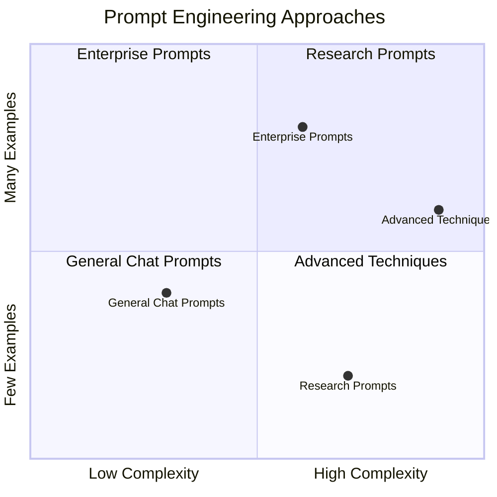
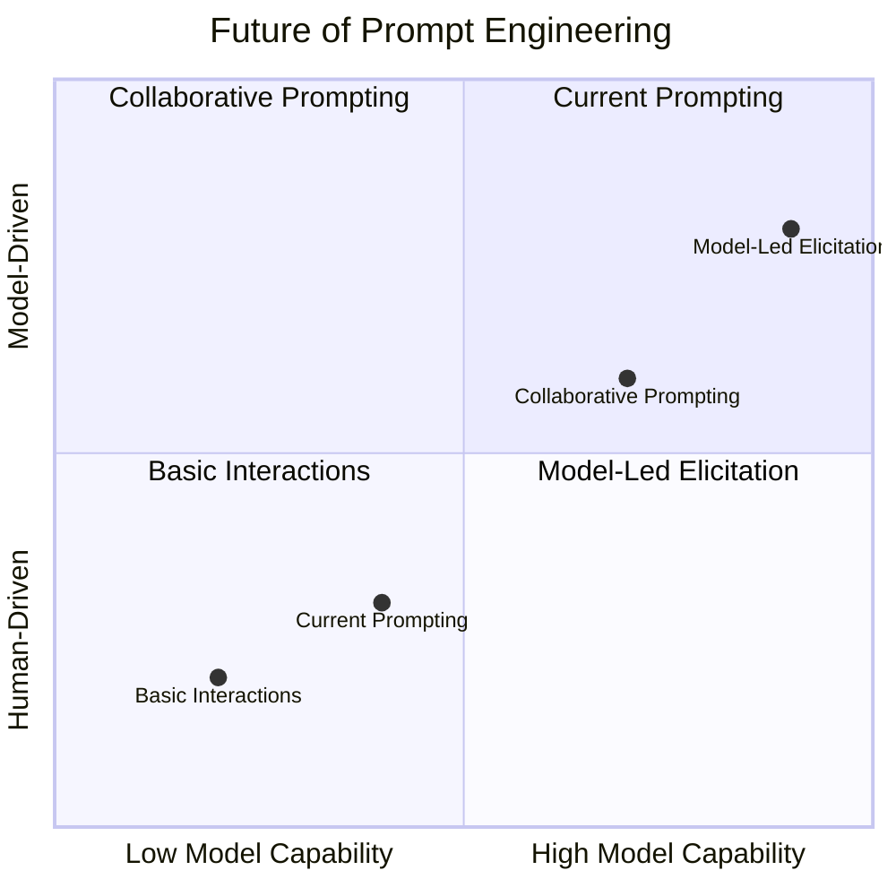

Here are two mermaid quadrant charts based on the reference text:

```mermaid
quadrantChart
    title Prompt Engineering Approaches
    x-axis Low Complexity --> High Complexity
    y-axis Few Examples --> Many Examples
    quadrant-1 Research Prompts
    quadrant-2 Enterprise Prompts  
    quadrant-3 General Chat Prompts
    quadrant-4 Advanced Techniques
    Research Prompts: [0.7, 0.2]
    Enterprise Prompts: [0.6, 0.8]
    General Chat Prompts: [0.3, 0.4]
    Advanced Techniques: [0.9, 0.6]
```

Prompt Engineering Approaches Quadrant Chart

```mermaid
quadrantChart
    title Future of Prompt Engineering
    x-axis Low Model Capability --> High Model Capability
    y-axis Human-Driven --> Model-Driven
    quadrant-1 Current Prompting
    quadrant-2 Collaborative Prompting
    quadrant-3 Basic Interactions
    quadrant-4 Model-Led Elicitation
    Current Prompting: [0.4, 0.3]
    Collaborative Prompting: [0.7, 0.6]
    Basic Interactions: [0.2, 0.2]
    Model-Led Elicitation: [0.9, 0.8]
```

Future of Prompt Engineering Quadrant Chart