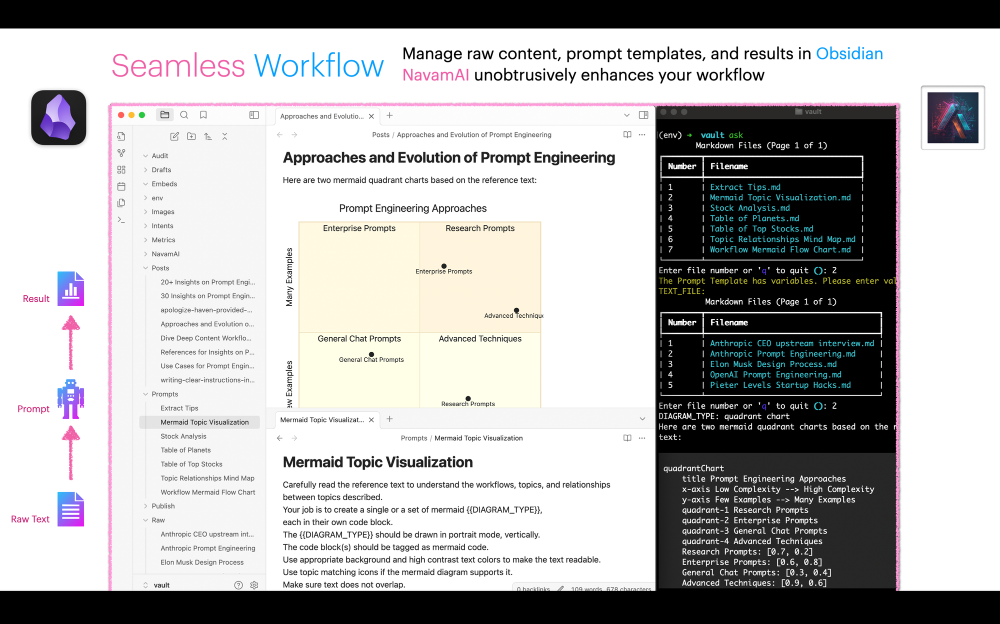
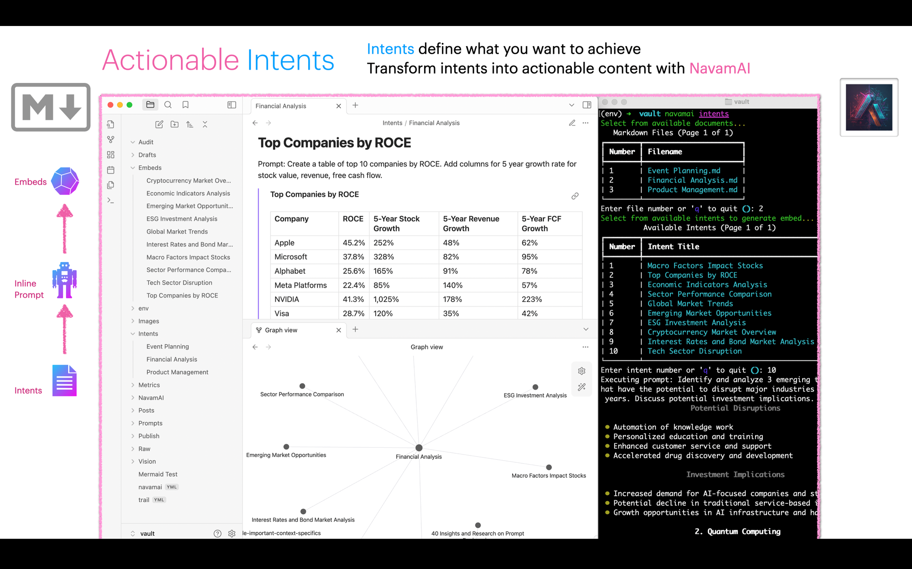
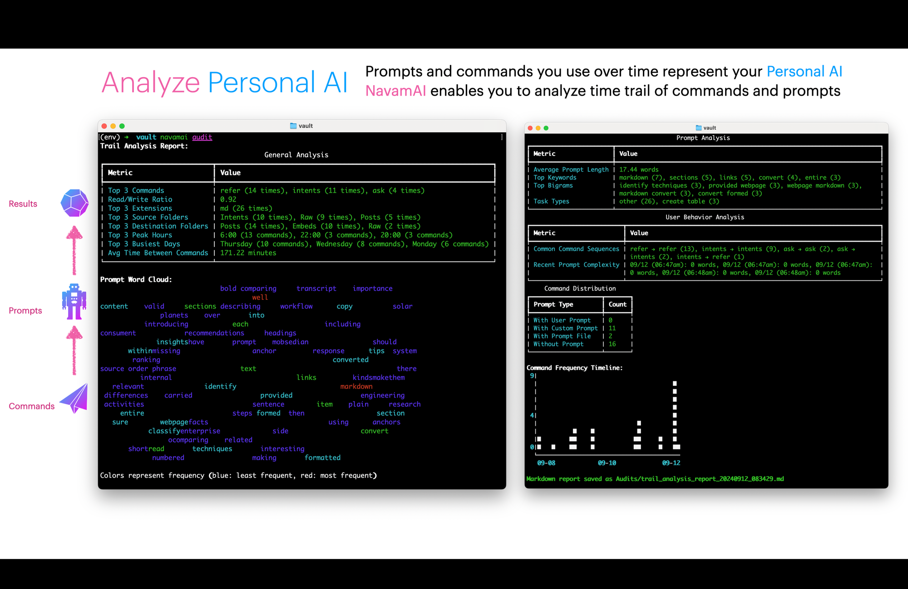
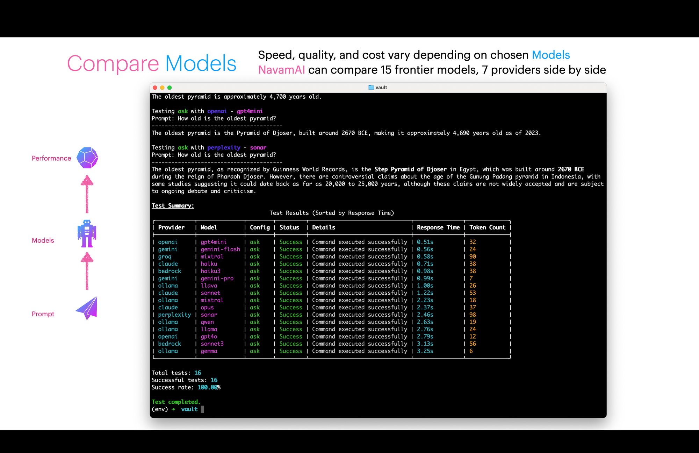
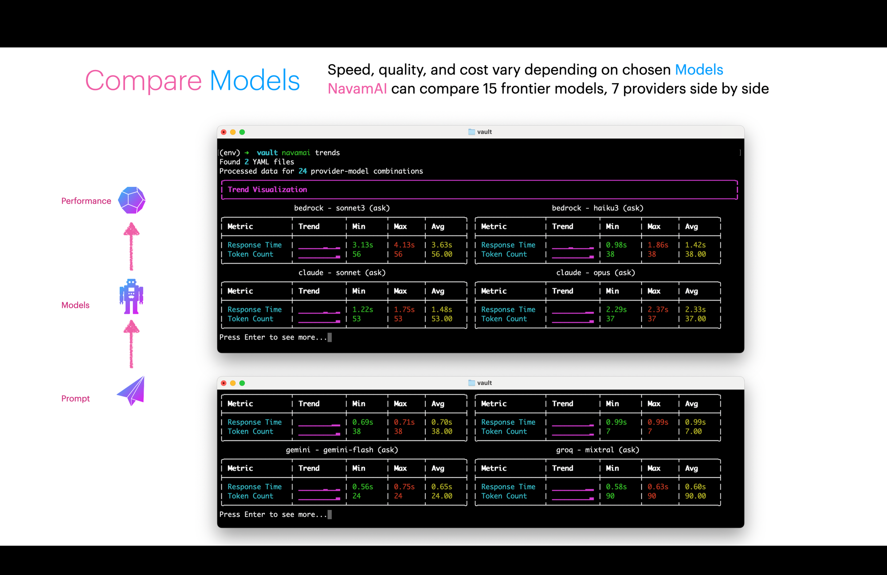
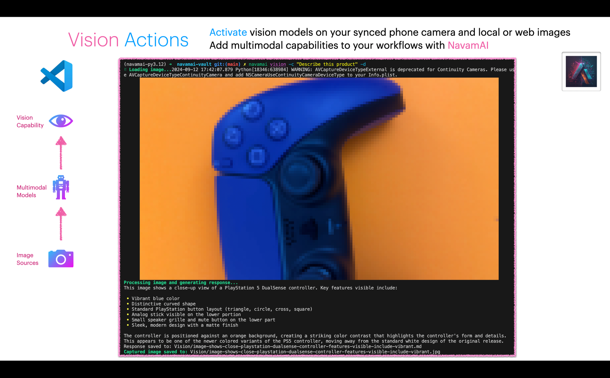

Use NavamAI to supercharge your productivity and workflow with personal, fast, and quality AI. Turn your Terminal into a configurable, interactive, and unobtrusive personal AI app. Power of 15 LLMs and 7 providers at your finger tips. Pair with workflows in Markdown, VS Code, Obsidian, and GitHub. Get productive fast with three simple commands.

Please watch our super exciting one minute product pitch video! Made with ❤️ using NavamAI and iMovie.

VIDEO

**Command Is All You Need:** So, the LLM science fans will get the pun in our tagline. It is a play on the famous paper that introduced the world to Transformer model architecture - Attention is all you need. With NavamAI a simple command via your favorite terminal or shell is all you need to bend an large or small language model to your wishes. NavamAI provides a rich UI right there within your command prompt. No browser tabs to open, no apps to install, no context switching... just pure, simple, fast workflow. Try it with a simple command like `ask "create a table of planets"` and see your Terminal come to life just like a chat UI with fast streaming responses, markdown formatted tables, and even code blocks with color highlights if your prompt requires code in response! NavamAI has released 13 commands to help customize your personal AI workflow.

**Top Models and Providers:** You can switch private models or hosted frontier LLMs with ease. NavamAI comes with configurable support for more than 15 leading models (GPT 4o, Sonnet 3.5, Gemini 1.5 Pro, Mistral NeMo, Sonar Llama 3.1...) from 7 providers (Ollama, Anthropic, OpenAI, Groq, Google, Bedrock, and Perplexity).

**Markdown Workflows:** NavamAI works with markdown content (text files with simple formatting commands). So you can use it with many popular tools like VS Code and Obsidian to quickly and seamlessly design a custom workflow that enhances your craft.

**Do More With Less:** NavamAI is very simple to use out of the box as you learn its handful of powerful commands. As you get comfortable you can customize NavamAI commands simply by changing one configuration file and align NavamAI to suit your workflow. Everything in NavamAI has sensible defaults to get started quickly.

NavamAI comes with configurable support for more than 15 leading models from five providers (Ollama, Anthropic, OpenAI, Groq, Google). The `navamai test` command can be used to run each of the navamai commands over all the provider and model combinations and respond with a summary of model test and evaluation results. Use this to quickly compare models and providers as well as when you add or remove a new model or provider in the config.

This command is super useful when comparing model response time (latency), response quality (does it follow the system and prompt instructions), response accuracy, and token length (cost) for the same prompt. You can configure the test prompts within `navamai.yml` in the `test` section.

Each `navamai test` command run saves the test summary data in `Metrics` folder by timestamp and provider-model. Over time you can visualize trends of latency and token count metrics to see if models are performing consistently. Run `navamai trends` command to view trends for 7 days (default).

The visualization uses sparklines to show data trends over time. Use this to decide when/if to switch models based on performance trends.

**Make It Your Own:** When you are ready, everything is configurable and extensible including commands, models, providers, prompts, model parameters, folders, and document types. Another magical thing happens when the interface to your generative AI is a humble command prompt. You will experience a sense of being in control. In control of your workflow, your privacy, your intents, and your artifacts. You are completely in control of your personal AI workflow with NavamAI.

One last thing. NavamAI also supports vision models. You can access your Mac synced phone camera right there from a single terminal command. How cool is that!

Want to continue learning more? Please subscribe below so you do not miss an update.

## Sign up for Enhance your craft with AI

NavamAI enhances your craft with personal, fast, and quality AI. Turn your Terminal or Shell into a rich personal AI. Supports 10 GenAI models by 5 providers. Pairs with Markdown, VS Code, Obsidian.

No spam. Unsubscribe anytime.
